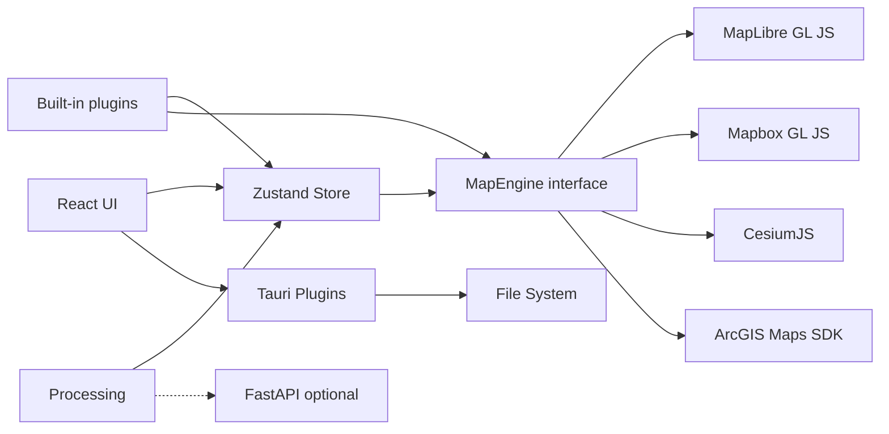

# GeoLibre Architecture

## Overview

GeoLibre is a free and open-source, lightweight, cloud-native GIS platform that runs in the web browser, on the desktop, on mobile, and inside Jupyter notebooks, all from a single npm workspaces monorepo. The UI is a React app that ships as a native desktop app hosted by Tauri v2 and as a browser-based web app, adapting responsively to mobile and small screens. Four engines can render a map: MapLibre GL JS (the default), Mapbox GL JS, CesiumJS, and the ArcGIS Maps SDK for JavaScript. deck.gl supplies advanced raster, point-cloud, and 3D overlays where an engine supports them. Application state lives in a Zustand store (`@geolibre/core`). See the user-facing [rendering-engine guide](user-guide/rendering-engines.md) and the detailed [MapLibre](maplibre-renderer.md), [Mapbox](mapbox-renderer.md), [Cesium](cesium-renderer.md), and [ArcGIS](arcgis-renderer.md) references.



## Packages

| Package                | Responsibility                                                                                 |
| ---------------------- | ---------------------------------------------------------------------------------------------- |
| `@geolibre/core`       | Domain types, project JSON schema, global store                                                |
| `@geolibre/map`        | Rendering-engine lifecycles and adapters, layer sync, GeoJSON, raster, tile, MBTiles, controls, and selection styling |
| `@geolibre/ui`         | Shared UI primitives (shadcn-style)                                                            |
| `@geolibre/processing` | Client-side algorithm registry                                                                 |
| `@geolibre/plugins`    | Plugin interface and built-in plugins                                                          |
| `@geolibre/embed`      | Typed, dependency-free client for the iframe embed API, published to npm                       |
| `geolibre-desktop`     | Shell layout, Tauri I/O, composition                                                           |

## State flow

1. User adds data through the Add Data menu, the Tauri dialog, browser file picker, drag and drop, or a built-in plugin control.
2. Local vector data is parsed directly or converted to GeoJSON with DuckDB-WASM Spatial, then passed to `addGeoJsonLayer` in the store.
3. Tile, service, raster, ArcGIS, MBTiles, and plugin-backed layers create `GeoLibreLayer` records with source metadata and native MapLibre layer ids when applicable.
4. The selected `MapEngine` subscribes to `layers` and reconciles them with its SDK. MapLibre uses `MapController.syncLayers`; Mapbox, Cesium, and ArcGIS use their engine-specific adapters. The layer-control glue shared by the two Style-Spec engines lives in `packages/map/src/layer-control-host.ts`.
5. Style panel and layer panel updates change layer state, then map sync updates paint, visibility, opacity, ordering, and removal.
6. Attribute table selections update the highlighted feature source and can zoom the map to the selected feature.
7. Desktop save uses `projectFromStore` and writes `.geolibre` to disk. The earlier `.geolibre.json` name remains readable.

## Rendering-engine model

The Zustand store is renderer-neutral: it contains plain `GeoLibreLayer`
records, preferences, and `MapViewState` values rather than objects owned by a
mapping SDK. MapLibre, Mapbox, Cesium, and ArcGIS each implement the shared
`MapEngine` interface for camera operations, capability checks, picking,
controls, placement, extent drawing, and capture. `primaryRenderer` selects the
main canvas, while each `SecondaryMapView.viewKind` selects the engine for a
split pane. Changing either value unmounts the previous engine and connects the
replacement to the same project state.

Capabilities are explicit rather than assumed. The shell gates commands against
the active `MapEngine`; layers report engine compatibility; and plugins declare
an `engines` list. This lets a project retain an unsupported layer or suspended
plugin across a switch without asking every SDK to emulate every feature.

## 3D globe view (CesiumJS)

The default MapLibre map can be joined by — or replaced with — a 3D globe rendered with [CesiumJS](https://cesium.com/platform/cesiumjs/). Cesium subscribes to the same engine-neutral store described above, whether it owns the primary canvas or one pane in a mixed-engine grid. MapLibre remains the default; integrations that paint directly through the MapLibre style API still require MapLibre.

- **Where it renders.** Two places, both drawing the same store state:
  - **As a secondary pane.** Each pane in the map grid carries a 2D/3D toggle (`SecondaryMapView.viewKind`), so a globe sits beside the 2D map for comparison.
  - **As the primary map** (issue #2217). **View → Rendering engine → Cesium** selects the globe through the store's `primaryRenderer`. `DesktopShell` mounts `PrimaryCesiumCanvas` in place of the previous engine's canvas, so that renderer is not merely hidden — it is unmounted and stops consuming GPU resources. Switching adds or removes no panes, and a multi-pane grid can still mix all four engines. `CesiumCanvas` distinguishes the two roles by whether it is given a `viewId`: with one it is a pane backed by a `secondaryMapViews` record (own camera, own visibility overrides); without one it _is_ the primary map, reading and writing the shared `mapView` directly and ignoring the `syncView` toggle (which exists to make panes follow the primary camera). Because every engine reads the same store, the camera, basemap, layers, groups, visibility, and opacity survive the switch untouched where supported.
- **What the globe cannot do (yet).** Every tool that drives a `MapController` — the map context menu, legend, comments, story map, terrain settings, the ML panels, and the MapLibre-typed plugin API — is MapLibre-only. Rather than leave them broken, `DesktopShell` does not mount them while the globe owns the primary area, and the View menu greys out the items that drive a controller (zoom, viewport history, Reset Orientation, Set View, the Google Maps/Earth hand-offs) instead of letting them silently do nothing. Renderer-neutral, store-driven surfaces (the Layers panel, Style Manager, the attribute table, processing, the Dashboard) stay available. Layer kinds the globe cannot draw stay in the project and are tagged "2D only" in the Layers panel, and come back when MapLibre does. A renderer-neutral controller interface is the follow-up milestone in #2217.
- **Enabling it.** The 2D/3D pane toggle and the Rendering engine menu are both offered whether or not a Cesium Ion token is configured — the globe draws the project basemap, which needs no token. A token adds Cesium World Terrain and supplies Ion World Imagery as the fallback for a basemap with no raster form; without one the view shows a one-line hint saying so. The token is resolved through `getCesiumIonToken()` (`@geolibre/core`), which reads `VITE_CESIUM_TOKEN`/`CESIUM_TOKEN` from the build **or** from a runtime override, so it can be set at build time (`CESIUM_TOKEN`; see [Optional 3D globe credentials](getting-started.md#optional-3d-globe-credentials-cesium-ion)) or at runtime with no rebuild. Settings → Environment Variables has a dedicated masked **Cesium Ion token** field backed by device-local `DesktopSettings` (localStorage, never the shared project file); `useRuntimeEnvironmentVariables` projects it into `VITE_CESIUM_TOKEN` on the `window.__GEOLIBRE_RUNTIME_ENV__` global (empty values are not projected, so they cannot blank a build-time token). The shared `useCesiumIonToken()` hook re-resolves the token on the `geolibre:runtime-env-change` event and both mount sites key the globe on it, so a newly entered token takes effect without a reload.
- **Basemap.** `basemapToCesiumImagery()` (`@geolibre/core`) translates the project's `basemapStyleUrl` into a plain descriptor of what the globe should draw, and `applyBasemapImagery()` (`packages/map/src/cesium-basemap.ts`) turns that into imagery layers. The split keeps the decision engine-free and beside the basemap catalogs it reads, so the 2D and 3D renderers share one source of truth. Planetary and regional basemaps are already raster tile sets and carry straight over (TMS sources get `{y}` swapped for Cesium's `{reverseY}`, and a hybrid basemap's labels overlay rides directly above its imagery); GeoLibre's own vector styles map to a keyless raster basemap of matching tone, so a dark project basemap gives a dark globe; the blank basemap leaves a bare ellipsoid. Anything else — a provider style, a custom URL, an offline archive — has no raster form, and the renderer falls back to Ion World Imagery when a token is configured and OpenStreetMap when not. The basemap layers are inserted at the bottom of the imagery stack (index 0, the overlay at 1), which is what keeps them below the data layers `CesiumLayerSync` appends and raises to the top.
- **Lazy loading.** The whole Cesium engine (~4.8 MB) is `import()`-ed only when a globe first mounts, kept in its own build chunk (`manualChunks`) and off the 2D boot path. A Vite plugin (`vite-plugins/copy-cesium-assets.ts`) stages Cesium's runtime Workers/Assets/Widgets into `public/cesium/` and the canvas sets `window.CESIUM_BASE_URL` so the engine finds them.
- **Drawing.** Both engines implement `drawExtent` with a shared pointer lifecycle and geographic extents. Cesium uses a draggable entity for manual placement and ground-clamped rectangles for extraction previews. Escape, pointer cancellation, focus loss, and renderer teardown restore navigation. The raster-subset panel uses these operations on both renderers; crossing extents retain west > east so the extractor can explain that they must be split. The basemap extraction panel shares the drawing helper, while its menu remains gated on vector-style support.
- **Camera sync.** `packages/map/src/cesium-camera.ts` converts between MapLibre's Web-Mercator `MapViewState` (zoom, nadir-referenced pitch, bearing) and Cesium's camera (metric range, horizon-referenced pitch, heading), matched by **ground resolution** (metres per pixel) so the on-screen scale stays in step even when the panes differ in height. `CesiumCanvas` seeds its camera from the shared `mapView`, applies store changes to the globe, and writes the globe's own moves back — bidirectional, like the 2D panes — with a tolerance check that suppresses the apply→`moveEnd` echo so there is no jitter loop.
- **Layer sync.** `CesiumLayerSync` (`packages/map/src/cesium-layer-sync.ts`) reconciles the store's `GeoLibreLayer[]` onto the globe the way `MapController.syncLayers` does for MapLibre, reusing the same per-pane visibility overrides and group effects as `SecondaryMapCanvas`. It renders the kinds where Cesium is the natural fit — GeoJSON (a draped `GeoJsonDataSource` whose entities are styled per feature by `createFeatureStyleResolver` (`packages/map/src/cesium-feature-style.ts`, issue #2278): it evaluates the same MapLibre expressions `@geolibre/core` builds for the 2D map — single, categorized, graduated, rule-based with per-rule symbol overrides, and expression modes, simplestyle properties, proportional sizing, metre-unit strokes — with the style-spec engine, so polygon fills and outlines, line widths and arrow decorations, circle radii, classified marker sprites, fill patterns, and the layer's zoom range (a shared `DistanceDisplayCondition`) match the 2D map; points draw as circles unless the layer renders markers; a point-only layer with `pointRenderer: "cluster"` clusters through the data source's `EntityCluster` with bubbles and abbreviated counts styled like the 2D cluster layers and switched off past `clusterMaxZoom`, and a point-only layer above 50 000 features bypasses entities for one `PointPrimitiveCollection` whose primitives carry the feature reference on `id` so picking, highlighting, and filters still work (`packages/map/src/cesium-points.ts`, issue #2282; the heatmap renderer has no globe form and draws as plain circles); with field or expression labels, halos, and label zoom limits), XYZ/raster/WMTS, WMS, ArcGIS MapServer (`ArcGisMapServerImageryProvider`), and georeferenced image overlays (`SingleTileImageryProvider`) (as `ImageryLayer`s), and 3D Tiles (a `Cesium3DTileset` primitive that consumes the layer's tileset URL, request headers, and altitude offset directly, and whose features are classified by `cesium-tileset-style.ts` (issue #2290): the layer's colour expression and composed feature filter are translated from MapLibre expressions into the 3D Tiles styling language and applied as a `Cesium3DTileStyle`, so a tileset categorizes, graduates, or follows a rule tree the way an extruded vector layer does, and the layer opacity reaches it as a white multiply that fades textured tiles without tinting them — an untranslatable colour or filter leaves the tileset drawing its own colours and showing every feature rather than guessing; the attribute names the Style panel lists come from the first rendered tile, published onto `metadata.fields` because a tileset carries its schema in the tiles rather than in the layer record; an ArcGIS I3S scene layer goes through Cesium's own `I3SDataProvider` instead of loaders.gl, a Gaussian-splat layer whose asset is a 3D Tiles tileset renders through the same branch because Cesium draws `KHR_gaussian_splatting` tiles natively, and a point cloud in 3D Tiles form gets `pointCloudShading` eye-dome lighting), plus COPC point clouds decoded in the browser with the `copc` package into a bounded `PointPrimitiveCollection` preview reprojected through the archive's WKT (`packages/map/src/cesium-point-cloud.ts`, issue #2285) — with live visibility/opacity, rebuild-on-source-change, and removal. Tile sources that reach the 2D map through a MapLibre custom protocol — COG tiles from the WASM tiler, raster PMTiles, local MBTiles, the desktop's native XYZ/WMS fetcher, KML super-overlays — render through `ProtocolImageryProvider` (`packages/map/src/cesium-protocol-imagery.ts`, issue #2283), a Cesium `ImageryProvider` that expands the `{z}/{x}/{y}` template the way MapLibre does, hands each tile URL to the handler in `maplibregl.config.REGISTERED_PROTOCOLS` (process-wide, so it works with no MapLibre map mounted), and decodes the bytes into an `ImageBitmap` flipped the way Cesium expects; an unregistered scheme is reported as a layer error rather than drawn blank. COG layers open the same `cog-tiler-wasm` source the raster control uses and render from the persisted `metadata.rasterState` (`cesium-cog-imagery.ts`), so a COG looks the same on both renderers; a COG restored from a project with only a desktop file path stays 2D-only until the raster control has reopened it. The raster symbology (brightness, contrast, saturation, hue) maps onto `ImageryLayer`'s own adjustments for every imagery kind. Tile-backed vector layers (`vector-tiles`, vector PMTiles, vector MBTiles, and ArcGIS vector tiles with a resolved style) are draped (`cesium-drape.ts`, issue #2284): the globe runs one hidden, single-tile MapLibre map that receives the same store layers through the headless `createLayerSync` path, renders one Web Mercator tile at a time (`jumpTo` the tile centre, wait for `idle`, read the canvas back), and feeds Cesium through a `ProtocolImageryProvider`, so the Style Spec is never re-implemented and every style, filter, order, and visibility edit rebuilds the drape's imagery layer. ArcGIS vector-tile imports persist their resolved sources and prefixed style layers, allowing the headless sync to recreate them after a renderer switch or project reload and apply visibility, filters, and opacity while preserving service colors; the Style panel offers only opacity, order, zoom range, and filters for those layers rather than color editors that would not reach them. Older ArcGIS records without that resolved style remain 2D-only and must be re-added. Draped content is flat, its labels are placed per tile, and their glyphs come from a remote font host (so a local archive viewed offline drapes without text); picking on it, legacy `arcgis` records without a resolved style, Zarr, EPT and plain LAS/LAZ point clouds, raw `.ply`/`.splat` splat files, and deck.gl viz are still skipped on the globe and render in the 2D panes; the exported `isCesiumSupportedLayerType` predicate lets the pane's layer menu — and the Layers panel, when the globe is the primary renderer — tag those "2D only". Native KML/KMZ documents use `KmlDataSource`, preserving document styling, network links, and overlays; visibility and opacity are applied without replacing the original color properties. Local KMZ archives persist as data URLs. The Elevation Profile plugin draws native entities and samples the active terrain provider, rejecting results when that provider changes.
- **Globe interaction parity.** The primary globe publishes ground cursor coordinates and optional terrain elevation to the shared status bar, clearing them on pointer exit and teardown. Projected scene modes report a Mercator projection. Home, scene-mode, and fullscreen widgets participate in shared control positioning without remounting their DOM. In the Controls menu they answer to the existing entries: **Compass** governs the Home (reset view) button and **Globe** governs the scene-mode picker, as the globe's counterparts of the 2D reset-bearing and projection controls, and the toolbar replays those choices onto a freshly mounted globe.
- **Environment plugins.** The Sun simulation, Atmospheric Effects, Clouds, and Precipitation plugins declare MapLibre and Cesium (the Flight Simulator declares all three) and branch on `app.getCesiumScene()` (issue #2287), a typed handle to the primary globe's namespace, widget, scene, camera, and clock that `CesiumEngine.getCesiumScene()` exposes as the globe's counterpart to `getMap()`. On the globe the Sun drives a native `SunLight`, `globe.enableLighting`, and the scene clock (the night-side depth maps onto `globe.vertexShadowDarkness`); Effects toggles the sky box and atmosphere and re-tints `SkyAtmosphere` by hue/saturation/brightness shifts from the halo settings; the Flight Simulator shares its keyboard, physics, and HUD with both 2D maps behind a camera adapter — `camera.setView` each frame with `screenSpaceCameraController.enableInputs` suspended on the globe, `setFreeCameraOptions` on Mapbox, `calculateCameraOptionsFromCameraLngLatAltRotation` on MapLibre; the weather overlays are store tile layers and render through `CesiumLayerSync` unchanged. The Spinning Globe control needs no branch: it drives the store through the control host's MapLibre facade. `DesktopShell` re-attaches these plugins after either engine mounts, so a renderer swap rebinds them the way a MapLibre re-init does.
- **Persistence.** A pane's `viewKind` is part of `SecondaryMapView` and round-trips through the `.geolibre.json` project format (`normalizeSecondaryMapViews`), so a project saved with a globe pane reopens as the globe, token or not. The workspace's own choice persists as the top-level `primaryRenderer` (`normalizePrimaryRenderer`), written only when it is not the default — so a MapLibre project is byte-identical to one saved before the setting existed, and a 3D-first project reopens directly on the globe.

## DuckDB-WASM

Vector file import uses DuckDB-WASM for formats that need conversion before MapLibre can render them:

```sql
INSTALL spatial;
LOAD spatial;
```

GeoParquet is read with DuckDB's Parquet reader after loading Spatial. Other local vector formats are passed to Spatial `ST_Read` when the WebAssembly extension can load the GDAL-backed reader. Zipped Shapefiles are parsed with `shpjs` first, then DuckDB Spatial is tried if that parser cannot read the file. KML files (and the KML inside unzipped KMZ archives) are read by an in-house parser that preserves embedded symbology, emitting [simplestyle-spec](https://github.com/mapbox/simplestyle-spec) properties (`fill`, `stroke`, `stroke-width`, and so on) so styled KML renders the way it does in Google Earth; KML the parser cannot handle falls back to the DuckDB Spatial reader, which loads the geometry without the styling. A vector layer whose features carry simplestyle properties is rendered per-feature: paint expressions read the per-feature color/width and fall back to the flat layer style.

### Apache Iceberg

Iceberg tables are read on the same engine, with DuckDB's core `iceberg` extension loaded alongside Spatial (`INSTALL iceberg; LOAD iceberg;`). A table addressed by its metadata location is scanned with `iceberg_scan()`; an Iceberg REST catalog is `ATTACH`ed under a fixed alias, enumerated with `SHOW ALL TABLES`, and the chosen table read as a qualified name. Either generated statement is only a default: the dialog pre-fills it into a SQL box, and whatever is in that box becomes the scan's source, so a `WHERE`, a join, or a projection can decide which geometries are rendered. A custom statement is checked with `cleanStatement`/`containsMultipleStatements` (the literal-aware helpers in `sql-workspace.ts`) before being wrapped as a sub-select, so a pasted script fails with a clear message rather than a parse error pointing at the generated wrapper.

Geometry handling is deliberately narrower than the vector-file loader's. Only columns DuckDB reports as native `GEOMETRY` are candidates: Iceberg v3 has a real geometry type — `iceberg_column_definition.cpp` maps it to `LogicalType::GEOMETRY` — so a BLOB or VARCHAR here is an ordinary attribute, and the blob/base64-WKB fallbacks that make sense for plain Parquet would only produce loads that fail inside `ST_AsGeoJSON`. **The CRS comes from the schema, not the user.** DuckDB renders a CRS-annotated column as `GEOMETRY(<crs>)`, so `icebergTransformCrs` reads it and reprojects to WGS84 through `ST_Transform`; a column carrying no CRS parameter is `OGC:CRS84` by specification (the same constant DuckDB's extension hard-codes as `IcebergConstants::DefaultGeometryCRS`), which is already GeoJSON's lon/lat convention and passes through untransformed. Nothing about the coordinate system is persisted on the layer, so a table re-projected upstream stays correct on the next reload.

The work is split between `lib/iceberg.ts`, which holds the persisted layer config, the SQL builders, and the table-selection rule with no DuckDB dependency, and `lib/iceberg-loader.ts`, which owns the engine. The loader runs on the **SQL Workspace's** dedicated DuckDB instance rather than the shared one: an Iceberg scan reads the table's Parquet data files over HTTP, so it needs that instance's pre-spatial warm-up and its poisoned-instance recovery (see `resetSqlDatabase`).

Two consequences of Iceberg tables being large are wired into the app rather than left to the user. Every load is capped by a row limit, and the total row count — a `count(*)` over the configured source, which DuckDB can answer from the manifest metadata for an unfiltered table, though a custom statement's filters, joins, or projections have to be evaluated — is shown before anything is materialized. And the resulting layer, though refreshable on demand, is excluded from timer-driven refresh by `supportsAutoRefresh` in `lib/layer-refresh.ts` — re-scanning a table of that size on an interval is never what the user meant, so the automatic-refresh interval is unavailable for it rather than merely defaulted off.

## Advanced Add Data workflows

The Add Data surface includes native dialogs for XYZ, WMS, WFS, vector files (via the Add Vector dialog backed by `maplibre-gl-vector`), GeoJSON URLs, vector tile sources, delimited text, raster tile templates, COG and GeoTIFF rasters (via the Add Raster dialog backed by `maplibre-gl-raster`), MBTiles, ArcGIS FeatureServer or VectorTileServer layers, Apache Iceberg tables, and GPX waypoints, tracks, and routes. It also supports 3D Tiles layers, Cesium Ion assets by id (a tileset or imagery layer with `metadata.sourceKind: "cesium-ion"`, offered when the globe is the primary renderer and badged "3D only" on the 2D map; `packages/core/src/cesium-ion.ts`, issue #2290), WFS and GeoJSON URL refresh, text marker labels, and multiple DuckDB SQL query-result layers with identify, selection, and attribute table support. The Components plugin wraps `maplibre-gl-components` panels for FlatGeobuf, PMTiles, Zarr, LiDAR, and Gaussian splats, then mirrors added layers into the GeoLibre store so the Layer panel, project format, and layer control can reason about them. Additional data sources are available through the Planetary Computer and Earth Engine panels, the Overture Maps plugin, and the federal Web Services plugins. The Time Slider plugin, backed by `maplibre-gl-time-slider`, animates time series raster and vector data (COG, XYZ/WMTS, WMS-Time, and time-filtered GeoJSON) through a docked timeline, mirroring each source it adds into the GeoLibre store as an external native layer.

Local MBTiles tiles are read through a custom MapLibre protocol backed by Tauri commands. Remote rasters are fetched through the desktop backend when needed, and the local development server includes a raster proxy for selected release assets that need CORS handling.

## Python sidecar

The FastAPI app in `backend/geolibre_server` backs the format Conversion tools, the raster tools, and the optional server engine for the Whitebox toolbox through a managed local processing sidecar. The desktop app starts the sidecar on demand, communicates over `127.0.0.1`, and keeps the heavier Python processing stack outside the browser bundle.

The Whitebox toolbox does **not** depend on it: its 1,000+ tools run in the browser on the `geolibre-wasm` WebAssembly runtime by default, and the sidecar is an opt-in alternative engine that can read native file paths for batch runs over a directory.

The Vector tools (Processing → GeoLibre Toolbox → Vector) run client-side with Turf.js and need no sidecar. All of the tools can optionally run on the sidecar's `/vector` endpoints, backed by GeoPandas and Shapely, for projection-aware results; the sidecar reports availability through `/vector/status`, and the dialog falls back to the client engine when the optional `vector` extra is not installed.

A third Vector engine, **Python (Pyodide)**, runs the same GeoPandas/Shapely code **in the browser** via [Pyodide](https://pyodide.org) (CPython compiled to WebAssembly), so the GeoPandas path is available on the web build with no server. The geometry logic is a framework-free module, `backend/geolibre_server/geolibre_server/vector_ops.py`, that both the sidecar and the browser run — a Vite plugin (`vite-plugins/copy-vector-ops.ts`) copies it into the app bundle, and a classic Web Worker (`public/pyodide/pyodide-worker.js`) loads Pyodide from a CDN, installs `geopandas`, and calls `run_vector_tool` over a JSON-string boundary. One source of truth means the Sidecar and Pyodide engines return identical results. The Pyodide runtime is downloaded lazily on first use; the `VITE_PYODIDE_INDEX_URL` env var points it at a self-hosted mirror for offline/production deployments.

The **SQL Workspace** offers an **Apache Sedona** engine alongside DuckDB and PostGIS. It runs Sedona spatial SQL on [SedonaDB](https://sedona.apache.org/sedonadb/), the single-node Rust (DataFusion + Arrow) engine, through the sidecar's `/sql` endpoints (`/sql/status`, `/sql/run`) backed by the optional `sedona` extra (`apache-sedona[db]`). In the browser — and on desktop when the extra is not installed — the same engine runs entirely client-side on [CereusDB](https://github.com/tobilg/cereusdb), a WebAssembly build of SedonaDB; the workspace prefers the sidecar when reachable and falls back to CereusDB automatically. The CereusDB bundle is large, so it is dynamically imported into its own chunk and only downloaded when a Sedona query first runs.

The sidecar has since grown past conversion: `raster.py` runs the Raster toolbox on rasterio/numpy/contourpy, `vector.py` backs the optional GeoPandas vector engine, and `ml.py` reverse-proxies AI Segmentation to the `samgeo-api` server (SamGeo/SAM 3), which is kept out of process because SAM 3 needs a multi-gigabyte GPU Torch build. Leafmap and GeoAI workflows are still expected to follow the same pattern.

## Offline support (PWA)

The standalone web build is an installable Progressive Web App. `vite-plugin-pwa` (configured in `apps/geolibre-desktop/vite.config.ts`) emits a web manifest plus a Workbox service worker, and `src/main.tsx` registers it next to `installStaleChunkReload` so the two coordinate. The service worker is built only for the web build; it is disabled for the Tauri desktop build (already offline via bundled assets) and the embedded Jupyter wheel (`GEOLIBRE_EMBED=1`), where `registerSW` resolves to a no-op.

Caching is split to keep the first visit light:

- **Precache (app shell).** The HTML and the JS/CSS chunks that boot the map are precached, so the shell loads with no network after the first visit. The heavy chunks below are excluded from the precache to avoid a large first-load download.
- **Runtime cache, CacheFirst.** The content-hashed build assets the precache skips (everything under `/assets/`) are cached on first use: the **MapLibre** bundle, **DuckDB-WASM and its spatial extension**, and the MapLibre feature-plugin chunks. Hashed filenames make CacheFirst safe — a redeploy mints new URLs, so a stale entry is never served as current. This is what makes local-file workflows (DuckDB Spatial conversion) work offline after they have run online once. Self-hosting the spatial extension via `VITE_DUCKDB_SPATIAL_EXTENSION_PATH` keeps it same-origin so it is cached too. **PGlite/PostGIS** is not in this same-origin list: it is fetched from the jsDelivr CDN to keep it out of the build — ~25 MB raw, and ~22 MB of otherwise-incompressible weight in the Tauri binary — so the PostGIS SQL engine needs network on first use. A separate rule caches it thereafter (see below).
- **Runtime cache, CDN engines.** A second CacheFirst rule (`geolibre-cdn-engines`) covers the heavy engines served from jsDelivr: **Pyodide** and its wheels, **PGlite/PostGIS**, the **CereusDB** (Apache Sedona) wasm, and `gdal3.js`. Their URLs embed the exact package version, so a redeploy mints new URLs and CacheFirst never serves a stale engine, and jsDelivr's permissive CORS headers mean these come back as normal (non-opaque) 200s that can be revalidated and evicted like any other entry. This is what lets the browser SQL (PostGIS), Sedona SQL, and Python features work offline **after their first online use**. When `GEOLIBRE_PGLITE_CDN=0` / `GEOLIBRE_CEREUS_CDN=0` those engines are bundled under `/assets/` instead and this rule simply never matches them; Pyodide is always CDN-loaded regardless. The rule also covers `/npm/@duckdb/`, which matches when `GEOLIBRE_DUCKDB_WASM_CDN=1` moves DuckDB off the origin (below) and when `maplibre-gl-duckdb` fetches its own engine, which it does from jsDelivr in every build.
- **Basemaps.** Tiles and styles from the CORS-friendly default hosts (OpenFreeMap, CARTO) are runtime-cached. Other remote tiles, services, and ArcGIS/WMS/WFS sources stay network-only by design and are unavailable offline.

So each of these CDN engines needs the network on **first** use, then works offline. To remove even the first-use dependency, build with `GEOLIBRE_PGLITE_CDN=0` and `GEOLIBRE_CEREUS_CDN=0`, which vendor PGlite/PostGIS and the CereusDB wasm back into the build under `/assets/`, where the same-origin rule covers them (PGlite alone re-adds ~22 MB to the Tauri binary).

To strip **all GeoLibre-controlled** external CDN references from the build output — for deployments that cannot load any resource from untrusted CDNs — use `GEOLIBRE_NO_EXTERNAL_CDN=1`. This implies `GEOLIBRE_PGLITE_CDN=0`, `GEOLIBRE_CEREUS_CDN=0`, `GEOLIBRE_GDAL_CDN=0`, and `GEOLIBRE_DUCKDB_WASM_CDN=0`, and additionally disables features whose code references external CDNs: storymap HTML export (which injects `<script>` tags from `unpkg.com`), built-in object detection models (YOLO ONNX weights from `cdn.jsdelivr.net`), the ONNX Runtime WASM backend, 3D Tiles Draco/KTX2 decoder fallback paths, and the default Pyodide index URL. Note: some third-party npm packages (DuckDB-WASM, loaders.gl, maplibre-gl-3d-tiles) contain their own internal CDN URL strings that cannot be removed without forking them; these are data/WASM fetch targets (`connect-src`), not remote script execution (`script-src`). The 3D Tiles decoders are the case worth spelling out: three.js's `DRACOLoader`/`KTX2Loader` fetch `draco_wasm_wrapper.js` / the basis transcoder **as text** and the matching `.wasm` as an ArrayBuffer (so `connect-src`), then concatenate the JS into a `Blob` and run it with `new Worker(blobURL)` — no `importScripts`. So compressed 3D Tiles need `worker-src blob:`, not a remote `script-src` allowance.

**DuckDB-WASM goes the other way**, because it is on the critical path for opening a local vector file and so is bundled by default. `GEOLIBRE_DUCKDB_WASM_CDN=1` moves it to jsDelivr instead — or `npm run lite:build`, which sets that flag and then _asserts_ no emitted file exceeds the ceiling, so a regression fails the build rather than the upload. It is pinned to the installed version by duckdb-wasm's own `getJsDelivrBundles()`, so the fetched engine cannot drift from the loader compiled into the bundle. The flag exists for one reason: `duckdb-mvp.wasm` (~40 MB) and `duckdb-eh.wasm` (~35 MB) both exceed the **25 MiB per-asset limit on Cloudflare Pages and Workers static assets**, which rejects the upload outright, and nothing else in the build comes close (the next largest is ~22 MB). So this single flag decides whether the web build can be hosted there at all — it takes the output from ~251 MB to ~176 MB with no file over the ceiling. GitHub Pages allows 100 MB per file and needs none of this. The flag is ignored for both targets that ship no service worker: a Tauri build, which must stay offline-capable, and an embed build (`GEOLIBRE_EMBED=1`), where the engine would otherwise be refetched every notebook session with no runtime cache behind it. Neither has the size ceiling this exists for, since a binary and a wheel are not uploaded to Cloudflare. A CDN-hosted worker script cannot be passed to `new Worker` (it must be same-origin), so that variant wraps it in a same-origin blob that `importScripts` the real one; this needs `worker-src blob:` and the CDN in `script-src`, both already in `docker/nginx.conf`. The nested `importScripts` is matched against `script-src` rather than `worker-src` — verified against that policy in Chromium and Firefox, since Firefox has historically checked worker sub-resources against `worker-src`/`child-src`.

Two engines have no such escape hatch. **Pyodide** is always fetched: `VITE_PYODIDE_INDEX_URL` re-points it at a mirror you host — worth doing when jsDelivr is unreachable or disallowed — but note that neither CacheFirst rule matches such a mirror, since one is scoped to `cdn.jsdelivr.net` and the other to same-origin `/assets/`, so unless the mirror is served from under `/assets/` it falls back to ordinary HTTP caching rather than the service worker. **`gdal3.js`** — which backs the Georeferencer's client-side GeoTIFF/COG export — is never vendored at all: its wasm (~28 MB) and data (~12 MB) only ever come from the CDN, and `GEOLIBRE_GDAL_CDN=0` opts out of that rather than bundling them, leaving the loader with no paths and that export unavailable.

The **desktop** build ships no service worker, so none of this runtime caching applies there: it re-fetches every CDN-loaded engine on first use per install, unless PGlite/PostGIS and CereusDB are bundled with the flags above.

A new deploy is picked up via `registerType: "autoUpdate"`: the new service worker installs in the background and takes control (`skipWaiting` + `clientsClaim`), so its fresh precache serves subsequent requests. Workbox's default force-reload-on-activation is deliberately suppressed via `onNeedReload` in `src/main.tsx` — on the relative-base `/demo/` subpath that reload fired spuriously and discarded in-progress map state. Page recovery is delegated to `installStaleChunkReload`, which reloads on-demand only when an orphaned lazy chunk 404s (cooldown-guarded; if `sessionStorage` is blocked it skips the reload and lets the preload error surface). Precached chunks are served from cache and never 404, so the page is no longer reloaded out from under the user.

## Container image

The root Dockerfile packages the browser version of the app. It uses a Node build stage to run the workspace build for `geolibre-desktop`, then copies `apps/geolibre-desktop/dist` into an nginx runtime image. The nginx config serves static assets and falls back to `index.html` for browser-entry URLs.

The `Publish Container Image` GitHub Actions workflow builds the image for pull requests and publishes it to GitHub Container Registry for pushes to `main`, version tags, and manual runs. The upstream image name is `ghcr.io/opengeos/geolibre`.

The image also bundles the optional Python sidecar (uvicorn) and reverse-proxies it at `/sidecar`, so the browser reaches it same-origin with no CORS; set `GEOLIBRE_DISABLE_SIDECAR=1` to run nginx alone. The container does not run the Tauri desktop shell, so workflows that depend on desktop filesystem access still require the installed desktop app. See [Run with Docker](getting-started.md#run-with-docker) for what the bundled sidecar does and does not back.

## Security

- Tauri CSP allowlists tile and style hosts (OpenFreeMap, CARTO).
- File access uses dialog-selected paths only.

### Native HTTP trust store and mutual TLS

The desktop app issues some remote fetches (tile/URL resolution, OGC
GetCapabilities, and similar) from the native Rust process rather than the
WebView. That path (`guarded_http_client` in `src-tauri/src/lib.rs`) trusts the
**OS/system certificate store** in addition to the bundled Mozilla roots, so a
server signed by an enterprise CA installed on the machine is accepted without
extra configuration.

For endpoints behind **mutual TLS (mTLS)**, the WebView `fetch` path shows an
interactive OS certificate prompt; the native Rust client cannot, so point it at
a client certificate with environment variables:

| Variable                             | Purpose                                                                                                                                                      |
| ------------------------------------ | ------------------------------------------------------------------------------------------------------------------------------------------------------------ |
| `GEOLIBRE_HTTP_CA_CERT`              | Path to a PEM bundle of extra CA certificate(s) to trust, on top of the OS store (for a private CA not installed system-wide).                               |
| `GEOLIBRE_HTTP_CLIENT_CERT`          | Path to the client certificate to present. A `.pem` file (certificate chain plus an **unencrypted** PKCS#8 private key) or a PKCS#12 bundle (`.p12`/`.pfx`). |
| `GEOLIBRE_HTTP_CLIENT_CERT_PASSWORD` | Passphrase for a PKCS#12 client certificate. Its presence also forces the PKCS#12 code path.                                                                 |

A `.p12`/`.pfx` extension (or a supplied passphrase) selects PKCS#12; any other
path is read as PEM. PEM identities use the default rustls backend; PKCS#12
identities use the platform native-tls backend (SChannel on Windows, Secure
Transport on macOS, OpenSSL on Linux), which also reads the OS trust store.
Convert a PKCS#12 export to PEM with
`openssl pkcs12 -in cert.p12 -out cert.pem -nodes` if you prefer the rustls path.
A set-but-empty value for any of these variables is treated as unset.

The configured client certificate is held on the shared native HTTP client and
is therefore **presented to any HTTPS server that requests one** during a native
fetch (tile, style, and OGC hosts a project points at), not only the endpoint the
certificate was issued for. TLS sends a client certificate only when the server
asks for one, so this is not an unconditional disclosure, but configure a client
certificate only when the hosts the app talks to are trusted.

## Performance: map rendering on Linux (WebKitGTK)

The desktop app uses the system WebView. On Linux that is **WebKitGTK**, whose
WebGL/JavaScript pipeline is materially slower than the Chromium engine the
browser build runs in. The most visible effect is **map panning at low zoom**:

- A blank map (no tile layer) pans at a steady 60 FPS at any zoom.
- With any tile layer (vector **or** raster XYZ), FPS collapses to single
  digits **while tiles are loading**, then snaps back to 60 once loading stops,
  at the same zoom. Low zoom only makes it constant because panning across the
  whole world loads tiles continuously and the cache never settles.

The cost is WebKitGTK processing each newly-loaded tile on the main thread: the
GPU upload of its texture (raster) or vertex buffers (vector) via synchronous
WebGL calls, plus the subsequent fade-in repaint frames. Vector tile parsing and
bucket building run in MapLibre's Web Workers, so they are not the bottleneck
here. Each tile-integration render cycle measured ~125 ms wall-clock in
WebKitGTK versus a few ms in Chromium. The gap is in WebKitGTK's WebGL
implementation and compositor pipeline (driver command-stream flush, TextureMapper
GL surface composition), not solely its JavaScriptCore JS engine. This is a
WebView-engine limitation, not a bug in GeoLibre, and it does not affect the
browser build or (untested) the macOS/Windows WebViews.

Ruled out during diagnosis (so future investigation does not repeat them):
software rendering (the GPU is used, Intel i915 confirmed), GPU saturation (the
render engine stays ~20% idle), the Tauri IPC file read (~126 ms for a 22 MB
GeoJSON), `JSON.parse` (~36 ms), KWin compositor latency, `renderWorldCopies`,
the globe vs. mercator projection, and `preserveDrawingBuffer`.

To reproduce the measurement: temporarily log MapLibre `render` events,
`dataloading` (tile) events, and a `requestAnimationFrame` counter once per
second; FPS tracks tile-load count inversely. The quickest check is this
frame-rate meter pasted into the WebView devtools console, then pan while
watching the logged FPS:

```js
let f = 0,
  t = performance.now();
(function loop(n) {
  f++;
  if (n - t >= 1000) {
    console.log("FPS", f);
    f = 0;
    t = n;
  }
  requestAnimationFrame(loop);
})(t);
```

Mitigations (reduce _how many_ tiles load during a pan, since per-tile cost is
fixed by the engine) are not yet implemented: a larger `maxTileCacheSize`,
512px raster tiles instead of 256px, and `fadeDuration: 0`, ideally gated to
WebKitGTK so the Chromium-based builds keep full fidelity.
