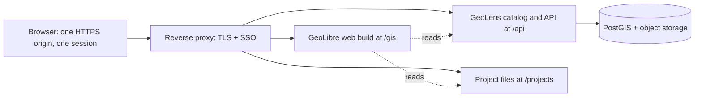

# Self-Hosting & Private Data

GeoLibre is a client-side application: the map, the layers, and the analysis all
run in the browser or in the desktop shell, and nothing is uploaded to a GeoLibre
service unless you explicitly use an optional online feature (see
[Privacy Policy](privacy.md)). That makes it a good fit for organizations that
cannot put their data on a public host at all: Indigenous and local communities
managing their own monitoring data, health and humanitarian programs, protected
species records, or any deployment where the data must stay on infrastructure the
organization controls.

What GeoLibre does **not** do is host your data. It reads data from wherever you
point it. So a private deployment is really two questions:

1. **Where do the datasets and projects live, and who is allowed to read them?**
2. **How does GeoLibre reach them from the browser?**

This page answers both. The short version:

!!! tip "Recommended setup"
    Host your data with **[GeoLens](https://getgeolens.com)**, a self-hosted
    spatial catalog (FastAPI + PostGIS) with accounts, per-dataset permissions,
    and OGC/STAC APIs. Host the **GeoLibre web build** next to it on the *same
    origin*, behind the *same* authentication layer. Then use GeoLibre's built-in
    **GeoLens plugin** to search the catalog and add datasets to the map. Every
    byte is served from your own origin to an authenticated browser and to
    nowhere else, credentials are sent only to that origin, and there is no CORS
    to configure.

## Why same-origin matters

Everything GeoLibre fetches is fetched by the browser, so the browser's rules
apply:

- **Cookies.** GeoLibre's requests use the browser default credentials mode
  (`same-origin`). A session cookie set by your SSO layer is sent automatically
  when the data URL is on the **same origin** as the app, and is **not** sent
  when it is on a different origin. So a cookie-gated dataset works out of the
  box on one origin, and cross-origin it fails whatever the server does, because
  the request arrives with no cookie for the server to check. Same-origin is
  necessary but not sufficient: the cookie's own `Path` still has to cover the
  URL being requested, so set it to `Path=/` for a layout that spreads the app,
  the API, and the project files across sibling paths.
- **CORS.** Same-origin requests need no CORS headers at all. Cross-origin ones
  need the data host to allow your GeoLibre origin explicitly.
- **Tile requests.** MapLibre issues raster and vector tile requests itself.
  Those follow the same cookie and CORS rules, which is why a tile endpoint
  gated by a session cookie only works when it is same-origin.
- **`?url=` projects.** A `.geolibre.json` loaded through the
  [`?url=` deep link](user-guide/embedding.md#url-parameters) is fetched the same
  way, so a project file behind your SSO layer loads when the app is served from
  that same origin, and fails with a network/CORS error when it is not.
- **Content Security Policy.** The Docker image and the desktop app both allow
  `https:` in `connect-src`, plus loopback for local development. A self-hosted
  data server must therefore be reachable over **HTTPS** (plain `http://` works
  only on `localhost` / `127.0.0.1`).

Putting GeoLibre and the data on one origin turns all five of these from
configuration problems into non-problems.

## Architecture



One hostname, one login, three paths. GeoLibre at `/gis` reads the catalog at
`/api`, the tiles at `/api/tiles/...`, and any saved projects at `/projects/...`,
all with the visitor's own session.

## 1. Host the data with GeoLens

[GeoLens](https://github.com/geolens-io/geolens) is an open-source, self-hosted
geospatial data catalog and map builder built on FastAPI, PostGIS, React, and
MapLibre. It is the piece GeoLibre deliberately does not try to be, and the two
line up well:

| GeoLens provides | GeoLibre consumes it as |
| --- | --- |
| Dataset search (fuzzy plus optional semantic ranking over pgvector) | The catalog list in the GeoLens plugin panel |
| Signed XYZ vector tiles (MVT) | A vector tile layer, token refreshed automatically |
| OGC API Features (`/api/collections/{id}/items`) | A GeoJSON layer with full attributes |
| STAC 1.0 and server-rendered raster tiles | A raster layer |
| Per-dataset permissions, accounts, OAuth 2.0 / OIDC SSO, per-user API keys | The identity that decides what the plugin can see |
| Uploads of Shapefile, GeoPackage, GeoJSON, GeoParquet, CSV, XLSX, GeoTIFF/COG | Nothing to convert by hand |

Your data stays in standard PostGIS and open formats, so nothing about this
choice is one-way.

Install it with Docker Compose on the same VM:

```bash
curl -fsSL https://getgeolens.com/install.sh | sh
```

Then set at least these in its `.env` before exposing it (see the
[GeoLens configuration reference](https://docs.getgeolens.com/guides/quickstart/configuration/)):

| Variable | Why it matters here |
| --- | --- |
| `PUBLIC_APP_URL` / `PUBLIC_API_URL` | The browser-facing URLs. These are what you type into the GeoLibre plugin, so they must be the public HTTPS ones, not the Compose service names. |
| `CORS_ALLOWED_ORIGINS` | Only needed if GeoLibre is served from a **different** origin. List that origin exactly. |
| `ENVIRONMENT=production` | Hides the API docs endpoints and hardens OAuth cookies. |
| `JWT_SECRET_KEY` | Signing secret for sessions. |

Upload your datasets and keep them private: GeoLens uses role-based access
control with per-dataset permissions. The GeoLibre plugin can then read them two
ways, and which one applies depends on how your deployment authorizes API
requests. On a same-origin deployment the plugin's calls carry the visitor's
GeoLens session automatically. Otherwise, create a per-user API key and paste it
into the plugin panel.

## 2. Host the GeoLibre web build next to it

The published image serves the production web build with nginx:

```bash
docker run -d --name geolibre -p 8081:80 \
  -e GEOLIBRE_SHARE_URL=off \
  ghcr.io/opengeos/geolibre:latest
```

For a deployment under a path such as `/gis`, bake the base path in at build
time and strip the prefix in your proxy:

```bash
docker build --build-arg GEOLIBRE_APP_BASE=/gis/ -t geolibre-private .
```

Settings that matter for a private deployment:

| Variable | Recommended value | Effect |
| --- | --- | --- |
| `GEOLIBRE_SHARE_URL` | `off`, or your own server | `off` removes Share and the Project Gallery entirely, so no project can be published to `share.geolibre.app` by accident. A URL points both at your own [projects server](server-api.md). |
| `GEOLIBRE_COLLAB_URL` | unset, or your own relay | Unset leaves [live collaboration](collaboration.md) dark. Set it to a `wss://` relay you run if you want multiplayer editing without the hosted relay. |
| `GEOLIBRE_GEOLENS_URL` | unset for the image default, `same-origin`, your GeoLens URL, or `off` | Pre-fills and automatically connects the GeoLens plugin. The stock image defaults to the browser origin, which suits a GeoLens API co-located behind the same reverse proxy. A URL must be a server root without a query or fragment. `off` keeps the panel idle until the user chooses a server. The last successful server is remembered per browser. |
| `GEOLIBRE_AUTH_USER` / `GEOLIBRE_AUTH_PASSWORD` | set, for a quick single credential | nginx Basic Auth over the app and the `/sidecar` API. One shared credential, not accounts. Use a real auth proxy for multi-user or SSO. |
| `GEOLIBRE_CLERK_PUBLISHABLE_KEY` | unset, or a Clerk publishable key | Unset keeps the app public and does not load Clerk. A key requires individual users to sign in before the web interface renders; protect server APIs separately. |
| `GEOLIBRE_CLERK_WAITLIST` | unset, or `1` alongside a Clerk key | Adds Clerk's waitlist form to the sign-in screen, so visitors can request access and you approve each one from the Clerk Dashboard. Leave unset for an invite-only ("restricted") instance, where nothing would act on a request. |
| `GEOLIBRE_AUTH0_DOMAIN` / `GEOLIBRE_AUTH0_CLIENT_ID` | unset, or both, if you use Auth0 instead of Clerk | The same sign-in gate backed by Auth0 Universal Login. Both are required together, and the container refuses to start if Clerk is configured as well — pick one provider. |
| `GEOLIBRE_CONVERSION_ROOTS` | `/data` (the image default) | Confines every sidecar read and write to the mounted directory. |
| `GEOLIBRE_POSTGIS_HOSTS` | unset unless needed | The sidecar's PostGIS endpoints refuse every destination until this names the allowed databases, so a caller cannot aim them at hosts only the container can reach. |
| `GEOLIBRE_DISABLE_SIDECAR` | `1` if you do not need it | Runs nginx only. |
| `GEOLIBRE_EMBED_ORIGINS` | unset, or the exact host page origin | Off by default, so a framed deployment cannot be driven by whoever frames it. |
| `GEOLIBRE_NO_EXTERNAL_CDN` (build arg) | `1` for restricted deployments | Strips GeoLibre's own references to external CDNs (`unpkg.com`, `cdn.jsdelivr.net`) from the build output. Features whose assets are only available from a CDN are disabled or degraded: storymap HTML export, built-in object detection models, ONNX WASM, 3D Tiles Draco/KTX2 decoders, and gdal3.js export. Pyodide is not hard-disabled — the flag drops only its default index URL, so setting `VITE_PYODIDE_INDEX_URL` to an approved mirror keeps it working. Also forces `GEOLIBRE_PGLITE_CDN=0`, `GEOLIBRE_CEREUS_CDN=0`, `GEOLIBRE_GDAL_CDN=0`, and `GEOLIBRE_DUCKDB_WASM_CDN=0` — so PGlite/PostGIS, CereusDB, and DuckDB-WASM stay **available**, vendored into the build under `/assets/` (at a larger build size) rather than fetched. Note that some third-party packages (DuckDB-WASM, loaders.gl, maplibre-gl-3d-tiles) carry their own internal CDN URLs that this flag cannot remove; see [architecture.md](architecture.md) for the details. Intended for deployments that cannot reference untrusted external CDNs (e.g. enterprise environments with strict CSP requirements). |
| `VITE_WELCOME_DISABLED=1` (build arg) | optional | Skips the first-launch wizard for every visitor. |
| `VITE_GEOLIBRE_CAPABILITIES` (build arg) | unset, or the capabilities to grant | Unset grants everything (today's behavior). Naming a subset — or `none` — pins what the interface offers: adding data, processing, export, plugins, settings, project authoring. Removes affordances only; it is not a server-side restriction. See [Deployment Capabilities](deployment-capabilities.md). |

See [Getting Started](getting-started.md#run-with-docker) for the full list.

!!! warning "Before exposing the image publicly"
    `docker/nginx.conf` allows `http://localhost:*` and `http://127.0.0.1:*` in
    `connect-src` so local development can load data from a dev server on
    another port. On a public host that lets the served JavaScript probe each
    visitor's loopback interface. Drop those allowances from the CSP for a
    public deployment.

### Putting both behind one auth layer

Basic Auth is fine for a single shared credential. For accounts or SSO, put
[`oauth2-proxy`](https://oauth2-proxy.github.io/oauth2-proxy/), [Authelia](https://www.authelia.com/),
or Cloudflare Access in front of the *unmodified* image, and route both
applications under one hostname. A minimal Caddy example:

```caddyfile
maps.example.org {
    # Everything is behind the same forward-auth / SSO layer.
    forward_auth authelia:9091 {
        uri /api/verify?rd=https://auth.example.org
        copy_headers Remote-User Remote-Groups Remote-Email
    }

    handle_path /gis/* {
        reverse_proxy geolibre:80
    }

    handle_path /projects/* {
        root * /srv/projects
        file_server
    }

    # Catch-all: GeoLens's own entry point, which serves its UI and routes
    # /api to its API service internally, so one upstream covers both. Check
    # your GeoLens deployment: if it exposes the API on a separate address,
    # give it its own route above this block, and match on `handle` rather than
    # `handle_path` so the `/api` prefix survives (the API expects it).
    handle {
        reverse_proxy geolens:8080
    }
}
```

With that in place:

```text
https://maps.example.org/gis/?url=https://maps.example.org/projects/watershed.geolibre.json
```

opens a private project for an authenticated user and returns the login redirect
for anyone else. No CORS headers, no tokens in URLs, and nothing served to
anyone the SSO layer has not admitted.

!!! important "Two layers of authentication, not one"
    The forward-auth layer decides who reaches the origin. It does not, by
    itself, tell GeoLens who the visitor is: GeoLens applies its own accounts and
    per-dataset permissions, and the GeoLibre plugin sends only what the browser
    attaches (a same-origin cookie) plus an `X-Api-Key` header if you gave it a
    key. So the visitor needs a GeoLens identity too. Either configure GeoLens to
    consume your provider (it supports OAuth 2.0 / OIDC, so point it at the same
    identity provider and a visitor who signs in gets a GeoLens session cookie on
    this origin), or have each user paste a per-user API key into the plugin
    panel. If neither is true, the app loads and public datasets appear while
    private ones stay invisible, which is a confusing failure worth ruling out
    first. `/projects` and other static files behind the proxy are unaffected:
    they are gated by the forward-auth layer alone.

!!! note "`url=` must be absolute"
    The project deep link is validated as an absolute `http(s)` URL, so
    `?url=/projects/watershed.geolibre.json` is ignored. Write the full URL, as
    above. It is still same-origin, so the session cookie is still sent.

## 3. Connect GeoLibre to GeoLens

The **GeoLens** plugin is built in. There is nothing to install, no marketplace
step, and no bundled drop-in to deploy: open the **Plugins** menu and choose
**GeoLens**.

In the panel:

1. Pick a server from the list or type your own base URL, for example
   `https://maps.example.org`. Give the server root, not the `/api` path: the
   plugin appends `/api/...` itself. A trailing slash is trimmed for you, and a
   bare hostname is read as `https://`.
2. Leave **API key** empty for public datasets, or paste a GeoLens API key to
   see and read private ones. On a same-origin deployment the request also
   carries the visitor's GeoLens session cookie, so if your deployment authorizes
   API requests by session, private datasets are visible with no key at all.
3. Search the catalog and add a dataset. Vector datasets can be added as **vector
   tiles** (fast, scale to large tables) or as **GeoJSON** through OGC API
   Features (full attributes, editable, subject to a feature limit you can set in
   the panel). Raster datasets are added as server-rendered raster tiles.
4. Each result carries a **Metadata** link back to its page in GeoLens.

Once a dataset is on the map it is an ordinary GeoLibre layer: style it, classify
it, open the [attribute table](user-guide/attribute-table.md), run
[processing tools](user-guide/processing.md) and
[spatial SQL](user-guide/sql-workspace.md) against it, and publish it into a
[Story Map](user-guide/storymaps.md) or an
[embedded map](user-guide/embedding.md).

### Editing back to GeoLens

A dataset added as GeoJSON can be redrawn with the GeoEditor or retyped in the
attribute table, and the plugin's **Edits** section writes the changes back to
the GeoLens dataset feature by feature. This requires credentials **and** a
server with dataset editing enabled (`enable_dataset_editing`, read at connect
time from `/api/settings/feature-flags/`). When it is off, the plugin shows
saving as unavailable rather than offering a write that would fail halfway
through.

### How credentials are handled

This is the part that matters for data sovereignty:

- The API key is held **in memory for the session only**. It is not written to
  `localStorage`, and it is not written into the project file.
- A saved `.geolibre.json` records only the GeoLens **server URL** and **dataset
  id** for each layer. Sending that project to someone else does not send them
  the data or the key.
- On reopening a project, layers from **public** datasets re-mint their signed
  tile token automatically and render. Layers from **private** datasets stay
  blank until you reconnect in the plugin panel with a key you are entitled to.
- Signed vector tile tokens are short-lived HMAC tokens minted per dataset, and
  the plugin refreshes them before they expire.
- A private raster's API key is attached to **exactly** that raster's tile URL
  prefix and to nothing else, so a basemap, another plugin's tiles, or a second
  GeoLens server on the same origin never sees it.
- Deactivating the plugin drops every registered key, so a private layer stops
  rendering. The credential does not outlive the plugin.

## The two deployment patterns, compared

These are the two options raised in
[discussion #1807](https://github.com/opengeos/GeoLibre/discussions/1807), and
they behave quite differently.

### Pattern A: GeoLibre on the community server (recommended)

Serve the web build from the same VM and the same origin as the data, behind the
same SSO layer, as described above.

| Property | Result |
| --- | --- |
| Session cookies reach the data | Yes |
| CORS configuration needed | None |
| Private `?url=` projects | Work |
| Private tiles, COGs, GeoParquet, FlatGeobuf on your own host | Work |
| Data or tokens reaching a third party | None |
| Cost | You run and update one more container |

This is the pattern to choose when the requirement is that the data must reach
nobody but the users your own auth layer admits, and no third-party service
along the way.

### Pattern B: hosted GeoLibre, private data elsewhere

A user opens `https://web.geolibre.app/?url=https://community.example.org/project.geolibre.json`.

The project fetch and every layer fetch is now cross-origin, so:

- **Session cookies are not sent.** A URL gated by an SSO cookie returns the
  login page (or a redirect), and GeoLibre reports a fetch or parse error. There
  is no setting that changes this.
- **CORS must allow `https://web.geolibre.app`** on the data host, including any
  custom request header you rely on.
- **Credentials must therefore travel in the URL or in a header.** In practice
  that means a **signed, expiring URL** (an S3/MinIO presigned URL, a GeoLens
  signed tile URL, or your own HMAC scheme), because MapLibre's own tile requests
  cannot carry a custom header that GeoLibre has not been told about. The GeoLens
  plugin is the exception on the header path: it sends `X-Api-Key` on its API
  calls, and attaches it to that dataset's raster tiles through MapLibre's
  `transformRequest` hook.
- **Tokens in URLs leak** into browser history, proxy logs, referrer headers, and
  anything the user copies and pastes. Keep expiries short and scope each token
  to one dataset.
- Your data host still sees requests from the user's browser, and the third-party
  app origin still serves the code that reads it. If your governance rules say
  the data may not be handled by software served from outside the community
  server, this pattern does not satisfy them even though the bytes go directly
  from your server to the user's browser.

Pattern B is a reasonable fit for **semi-public** data (a published map with a
capability URL) and a poor fit for **sensitive** data. When in doubt, use pattern
A: the web build is a directory of static files, so hosting it costs very little.

## Private data without GeoLens

GeoLens is the recommended path because it adds a catalog, accounts, and
permissions. If you already have data serving infrastructure, these all work
against a private, authenticated, same-origin host:

- **Cloud-native files.** COG, PMTiles, FlatGeobuf, GeoParquet, and Zarr are read
  with HTTP range requests, so any static file server behind your auth layer
  works. Serve them from the same origin and the session cookie is sent with
  every range request.
- **OGC services.** WMS, WMTS, and OGC API Features endpoints on your own server
  are added from the Add Data menu.
- **PostGIS.** On the desktop app, **Add Data → PostgreSQL/PostGIS** serves tiles
  straight out of a database through a local [Martin](https://martin.maplibre.org/)
  tile server, which is the closest analogue to pointing QGIS at a database. This
  is desktop only, and not available in the sandboxed Mac App Store build (see
  [Downloads](downloads.md#what-the-store-build-leaves-out)).
- **MBTiles and local files.** The desktop app reads local MBTiles, rasters, and
  vector files with no server at all, which is the simplest possible private
  workflow: download from the community server, analyze offline.
- **The sidecar.** If you enable the bundled Python sidecar, keep
  `GEOLIBRE_CONVERSION_ROOTS` pointed at exactly the directory you mounted, and
  leave `GEOLIBRE_POSTGIS_HOSTS` unset unless you need those endpoints.

## Reducing outbound requests

A private deployment usually also wants to minimize what the browser fetches from
the public internet:

| Feature | Default | How to keep it internal |
| --- | --- | --- |
| Basemaps | OpenFreeMap / CARTO tiles | Use the Basemaps plugin's **custom style URL** and serve your own style plus a PMTiles basemap from your server, or use a blank background. Add the host to the CSP if it is not your own origin. |
| Geocoding | Public Nominatim | Point it at a self-hosted Nominatim or Pelias (see [Data Integrations](user-guide/data-integrations.md#geocoding)). |
| Routing and isochrones | Public FOSSGIS Valhalla (`valhalla1.openstreetmap.de`) | Set `VITE_ROUTING_ENDPOINT` to your own Valhalla server. This covers Processing → GeoLibre Toolbox → Network and the **Drive time** / **Walk time** [quick actions](user-guide/map-controls.md#quick-analysis-from-a-clicked-point). Add the host to the CSP. |
| Pointer elevation readout | Public Open-Meteo elevation API, whenever 3D terrain has no sample for the point | Leave the readout off (it is off by default), or decline the consent prompt GeoLibre shows before the first remote lookup — that is the gate the resolver checks. Enabling 3D terrain makes the remote call rare but does not rule it out, since a point terrain cannot answer still falls through. |
| Python (Pyodide) vector engine | Loads Pyodide from jsDelivr | Set `VITE_PYODIDE_INDEX_URL` to a mirrored copy of the Pyodide distribution. |
| AI assistant | Off unless configured | Leave `GEOLIBRE_AI_URL` unset, or route it through your own proxy. |
| Project sharing | `share.geolibre.app` | `GEOLIBRE_SHARE_URL=off`, or your own [projects server](server-api.md). |
| Collaboration | Off unless configured | Leave `GEOLIBRE_COLLAB_URL` unset, or run `workers/collab-node` yourself. |
| Telemetry | None | GeoLibre collects no analytics or usage data. The hosted sites (geolibre.app, web.geolibre.app) run Google Analytics, but nothing you deploy does. The Docker image **cannot** turn it on: the `Dockerfile` declares no build argument for it, and the container's CSP does not allow `googletagmanager.com`. A build from source can, by setting `VITE_GEOLIBRE_GA_MEASUREMENT_ID` for `npm run build` with your own measurement ID; there is no runtime variable that enables it. See [Privacy Policy](privacy.md). |

## Deployment checklist

- [ ] GeoLens (or your own data host) running on the community VM, datasets
      private by default.
- [ ] GeoLibre web build served from the **same origin**, under a path such as
      `/gis`, built with the matching `GEOLIBRE_APP_BASE`.
- [ ] One TLS-terminating reverse proxy with your SSO layer in front of both.
- [ ] `GEOLIBRE_SHARE_URL=off` (or your own server) so nothing can be published
      externally by accident.
- [ ] `GEOLIBRE_CONVERSION_ROOTS` confined, `GEOLIBRE_POSTGIS_HOSTS` unset unless
      required, sidecar disabled if unused.
- [ ] Loopback `connect-src` allowances removed from the CSP.
- [ ] Basemap, geocoding, and Pyodide sources pointed at internal hosts if the
      deployment must not reach the public internet.
- [ ] A test with a **logged-out** browser: the app, the catalog, the tiles, and
      the `?url=` project should all be unreachable.

## Related pages

- [Getting Started: Run with Docker](getting-started.md#run-with-docker)
- [Server API](server-api.md) for self-hosting projects, accounts, and sharing
- [Collaboration](collaboration.md) for the self-hostable relay
- [Data Integrations](user-guide/data-integrations.md#self-hosted-catalogs)
- [Embedding & Sharing](user-guide/embedding.md)
- [Privacy Policy](privacy.md)
