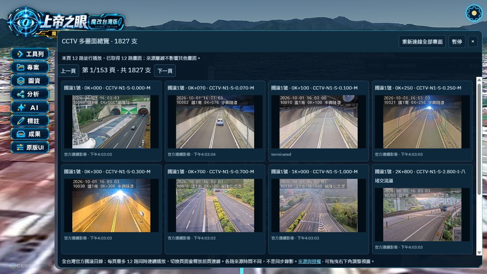
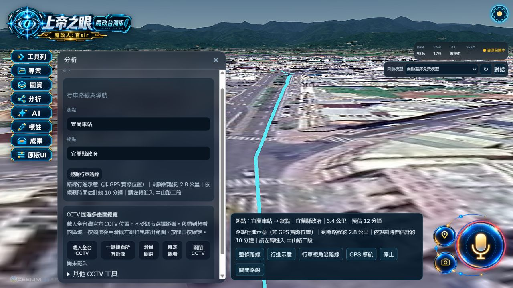
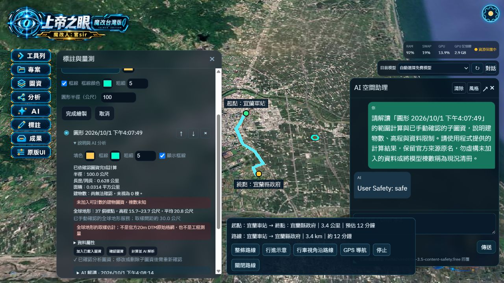
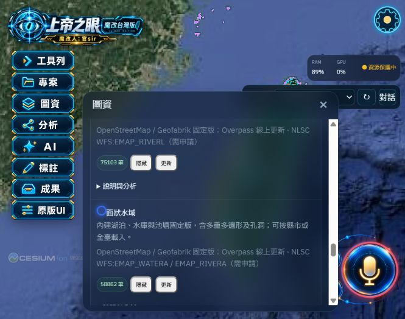

# 2026-10-01 瀏覽器版修正與驗收 V11

## 修改

- 地圖來源在儲存金鑰及切換底圖時重新取得設定；修正啟動時的舊金鑰狀態持續封鎖 Google/Bing 的問題。一鍵隱藏保留目前的 Google 擬真 3D。
- Gemini Live 固定台灣中文語音政策及繁體中文逐字稿；偵測未要求的英文回答時停止該段播放並要求中文重答。工具依序執行，連線停止後忽略舊回傳。
- 路線新增「行車視角沿路線」及語音工具 drive_route；鏡頭依路線方向與已載入地表高程連續前進，無需裝置定位。
- CCTV 以一條瀏覽器 NDJSON 連線接收多路真實官方 JPEG 影格，避免瀏覽器同站連線數限制及舊版單路播放取消其他來源。一鍵開啟全台官方國道目錄；每頁12路同時播放，可換頁、重連、暫停與關閉。
- 修正全球地形載入把 AbortController 當成文字的呼叫。繪製圖層確認全球地形子圖資後，實際向該服務取樣高程；官方20m DTM、匯入DTM樣點及全球地形分開顯示。
- 全台道路／三類水文改為內建全區 OSM 固定版，資料截至2026-09-30T20:22:42Z（台灣時間10月1日04:22:42）。道路573,905筆、河川／水系75,103筆、水域58,882筆、海岸線1,626筆；前三類涵蓋22縣市，海岸線涵蓋19個沿海縣市。完整向量供分析，畫面依效能模式抽取顯示；不需金鑰或數十次公開服務查詢。水域包含relation多重多邊形與孔洞，道路包含交流道匝道。
- 「更新」保留手動Overpass查詢；移除提前結束的筆數上限與單縣市截斷，外島縮小查詢框、兩路並行並去重。分批篩選使用隨附縣市界（既有約11公尺簡化），分區邊載入邊顯示，停止保留已取得向量。背景分頁使用訊息任務讓出主執行緒，避免計時器節流。線上失效時標示部分資料，並可按「載入內建固定版」恢復。
- Overpass 全部上游嘗試合計最多105秒；取消最後一個相同查詢的瀏覽器請求也會停止上游工作。記憶體快取加96MB容量預算，仍保留磁碟快取。部分失敗標示完成分區數，不宣稱完整資料。
- Ctrl+S 取消圖資載入後，舊工作的收尾不再重新打開面板。
- 固定版向量統計依不可變資料快取，避免開啟面板時反覆掃描數十萬圖徵。隱藏圖資後切換縣市／全台，來源範圍不符的舊圖層改顯示「載入」，不再誤觸線上更新。

## 已完成實測

|項目|證據|
|---|---|
|Google / Bing 恢復|Google 經一鍵隱藏仍保持已載入；Bing 影像隱藏後可再載入；Bing 影像與標籤可切換載入，未再顯示來源尚未就緒|
|Gemini Live|使用已保存的金鑰取得短效權杖；以中文文字訊息觸發原生語音回覆，收到15個音訊區塊，逐字稿「現在路線已經規劃完成，您可以開始使用行車視角了。」|
|行車視角|宜蘭車站→宜蘭縣政府，3.4公里、約12分鐘。相機沿路線持續移動，低角度跟隨且顯示轉向指示；停止可解除跟隨|
|CCTV|UI第1、2頁各12路同時取得畫面；暫停／重連正常。API抽查12路，每路至少取得3張不同SHA-256的真實影格，12路均有內容變化|
|全球地形|100公尺圓形，確認Cesium World Terrain子圖資後，取得37樣點，高程15.7–23.7公尺，平均20.8公尺；結果不再把全球地形當作沒有DTM樣點|
|重設|Ctrl+S 顯示所有功能已關閉，僅保留 Google 擬真3D底圖|
|全台道路|瀏覽器實際完成載入573,905筆，來源版涵蓋22縣市，無部分資料標示|
|全台三類水文|瀏覽器實際完成河川／水系75,103筆、水域58,882筆、海岸線1,626筆，四類可同時顯示於同一3D場景|
|外島與範圍切換|金門固定版實際載入道路3,925筆、水系215筆、水域418筆、海岸線330筆；一鍵隱藏後切回全台，四項均顯示「載入」，重新載入道路取得573,905筆，Google底圖仍保留|
|編譯|Vite正式建置通過；只有既有大型bundle與動態／靜態匯入提示|

內建圖資的來源PBF已比對Geofabrik提供的MD5；四個壓縮向量SHA-256與 metadata 一致。來源、日期、CRS、授權、22縣市覆蓋及雜湊保存在 `overlay/src/taiwan/data/osm-national-metadata.json`。OSM/Geofabrik來源標示保留於地圖歸屬資訊。

線上備援實測：114個道路分區取得175,784筆（32區成功，25區使用來源失效前快取）；81個水系分區取得44,692筆（41區成功）。因此預設載入改用完整內建版，線上部分結果不宣稱全台完整。來源網站「latest」下載連結曾發生301重新導向異常；使用實際清單列出的固定日期檔案成功下載，沒有將錯誤頁當作PBF。

GitHub鎖定上游b210ab0的獨立副本已完成首次套用，四個圖資雜湊均一致；修正安裝腳本重複套用Overpass修改與CRLF驗證問題。本次未對該新副本重新安裝依賴或編譯Tauri。

## 清理與打包

已移除12個未被程式引用的設計草稿、圖示預覽及重複鐵路解壓檔；總計約 7.24 MB。完整清單：cleanup-v11-20261001.json。官方鐵路原始ZIP、已下載DTM、目前使用的圖示、字型、原版功能與必要Whisper執行檔均保留。

執行 scripts/package-github.ps1 產出原始碼ZIP及逐檔SHA-256清單。排除安裝工作區、node_modules、dist、target、日誌、大型本機DTM與.env。依README與UPSTREAM.lock重新安裝，DTM可透過安裝腳本重新取得。

轉檔暫存PBF、座標索引及獨立安裝驗收副本均排除於ZIP。自動核准審查拒絕本次暫存PBF的刪除，只回覆政策阻擋，未提供詳細理由；故保留於本機暫存／.work，不以其他方式繞過刪除拒絕。

## 驗收範圍

- 本次以瀏覽器正式版驗收；未重新建置或驗收Tauri EXE。
- Gemini已驗證真實服務的中文語音產生；未錄製使用者麥克風，亦未代為授權裝置定位。
- CCTV來源為官方國道目錄，沒有以Street View或合成影像代替；來源離線會逐路顯示。每頁12路，非同時播放全部約1800多路；各路時間不同，不是同步錄影。
- 全球地形為取樣估計，來源解析度與官方20m DTM不同。OSM是當時來源可取得的資料，非官方道路、水文完整清冊；部分查詢失敗會註記。
- 內建版保留來源版本內所有符合分類及範圍的圖徵；不表示真實世界的道路與水文已完整建檔。海岸線與縣市界比對採0.001度（約百公尺）容差，原始線型未移動；不作法定邊界或工程量測。

## 畫面

