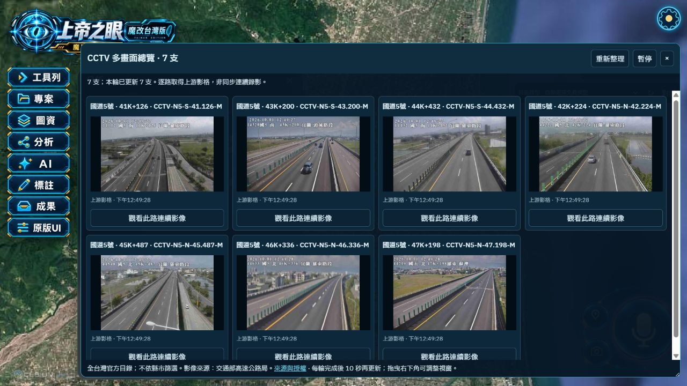
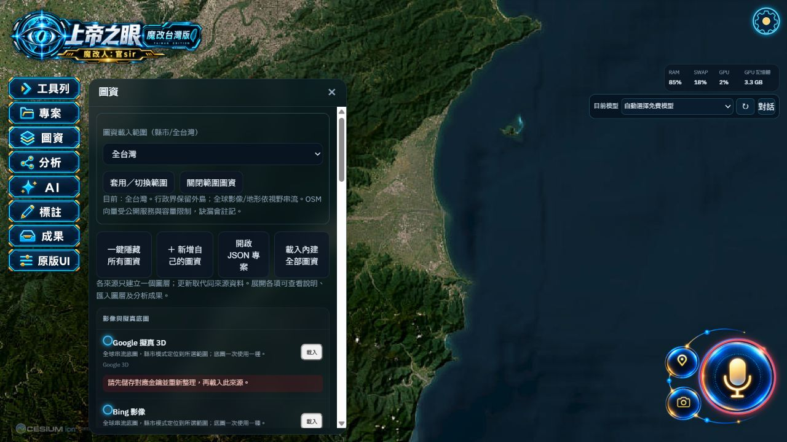
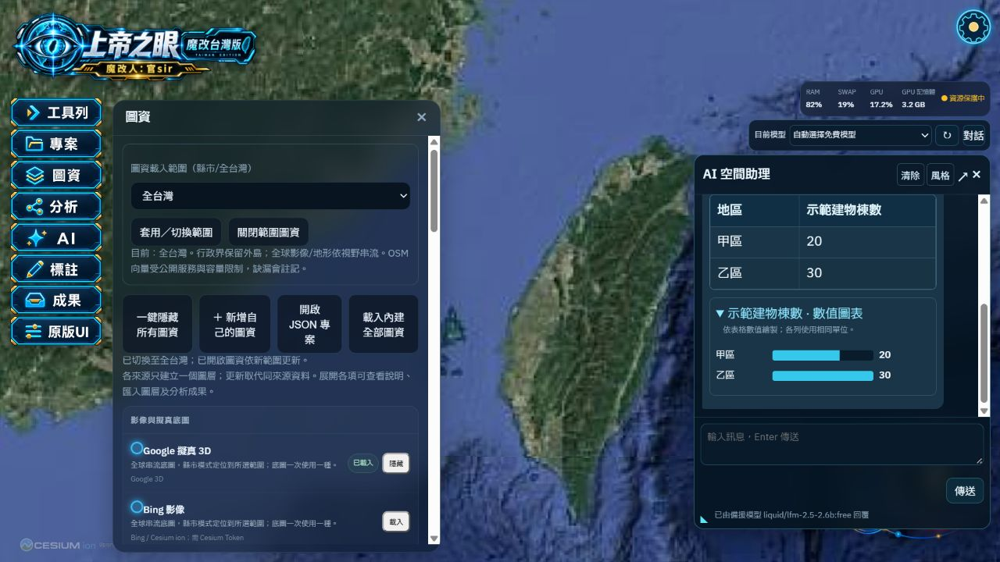
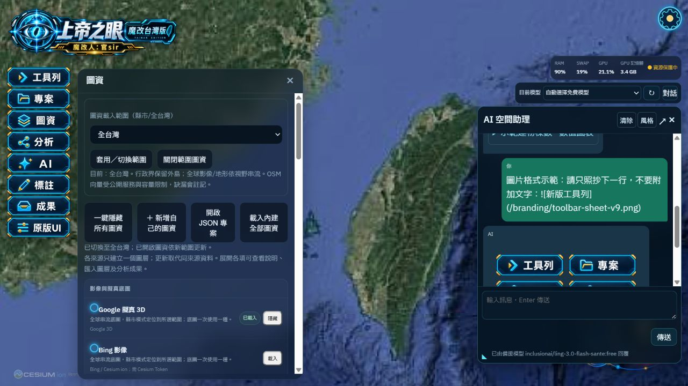
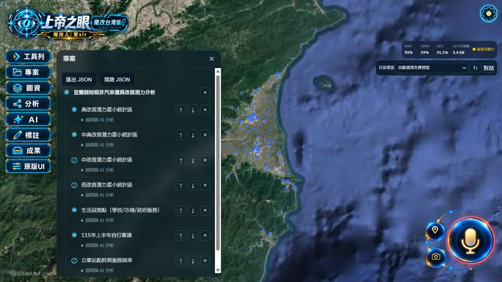

# 工具列 V9、AI 圖表與 CCTV 多畫面

## 本次修改

1. 八個按鈕的文字、圖示與藍金外框用內建 image_gen 一次生成。圖片存於 `branding/toolbar-sheet-v9.png`，完整提示詞見 `branding/toolbar-sheet-v9-prompt.md`。所有按鈕共用等尺寸安全區域，CSS 不再放大舊框裁切，保持 3:1 比例，依視窗高度縮小。
2. AI 表格以 HTML table 顯示，標題與粗體既有功能保留；同單位數值欄可展開長條圖。只繪製表格中已有的數值，不把不同單位強制比較。圖片 Markdown 轉為「顯示圖片」控制，點擊才連線圖片來源；限定 HTTPS／本機同源，無法載入時顯示錯誤。模型 HTML 仍全部跳脫。
3. 「專案」標題旁增加刪除按鈕，移除匯入專案及其階層圖資，不刪原始 JSON 檔及成果紀錄；其他工作區圖資保留。
4. 圖資載入範圍改為單一選單：全台灣＋22縣市。既有瀏覽器縣市設定可沿用。
5. CCTV 選項從圖資移至分析。新增專用全台目錄端點，不依縣市篩選，也不經全球 CCTV 共用容量分配。

## CCTV 使用流程

分析 → 載入全台 CCTV → 移動到所需區域 → 滑鼠圈選 → 在地圖按住左鍵圈出範圍（也可斜向拖曳框選）→ 確定觀看。

- 圈選後先顯示選取數量；尚未確認不請求影像。
- 所有選取攝影機都在同一總覽視窗中，畫面多時可捲動；右下角可調大小。
- 每輪最多四路同時取得官方 MJPEG 的實際 JPEG 影格，完成後等10秒再更新。每格顯示上游影格取得時間。輪詢影格不是同步連續錄影。
- 可單獨觀看一路官方連續影像；此時其他影格暫停更新。按重新整理回到多畫面。
- 暫停／關閉停止前端請求；斷線會中止後端串流。來源離線不以合成或 Street View 畫面替代。
- 開啟程式／匯入專案／切換圖資範圍不自動開啟 CCTV。圖資「一鍵隱藏」同時關閉 CCTV，Google 擬真底圖仍保持原狀。

## 資料來源與涵蓋

使用既有 [交通部高速公路局 CCTV 開放資料](https://data.gov.tw/dataset/37665)，由官方 `https://tisvcloud.freeway.gov.tw/history/motc20/CCTV.xml` 取得全台國道目錄。全台載入指本來源覆蓋的國道攝影機，並不代表已介接所有縣市地方道路、私人監視器或其他部會攝影機。目錄快取10分鐘；來源數量與畫面可用性隨官方服務變化。

## 實際驗收

- 正式 Vite build 成功，保留既有大型 bundle 及 Tauri import 警告。
- 官方目錄實際讀得1,827支；宜蘭區域以滑鼠斜向框選7支，確認後同一視窗的7路都取得真實上游影格，沒有備援畫面。
- 圖資選單包含全台灣＋22縣市，沒有第二個縣市選單。實際切換全台灣成功。
- 真實 OpenRouter 回覆的 Markdown 表格已顯示 HTML table，數值圖表可展開。圖表忠實使用收到的回覆，不補造模型省略的列。
- 圖片實際 AI 回覆提供 Markdown 後，可按顯示圖片，畫面出現圖集圖片。
- 從既有成果載入7層JSON專案，專案根節點可見刪除控制；實際刪除目前匯入專案後圖層清空，成果中的原紀錄保留，可重新載入。沒有刪除磁碟檔或不可復原的成果紀錄。
- 驗收使用 Codex IAB 的獨立資料；一般 Chrome 使用者按 Ctrl＋F5 更新。

## 畫面

- 最終來源檔與部署副本5/5 SHA-256一致，圖集亦已部署至正式dist。
- 1280×320短視窗：八個按鈕同為74.25×24.75（3:1），頂端110、底端308，皆在視窗內且標誌不遮擋；驗收後恢復一般尺寸。
- 官方單路連續影像HTTP200、multipart/x-mixed-replace及X-CCTV-Source=upstream-live，連續讀到兩個JPEG影格；結束讀取時已關閉連線。

