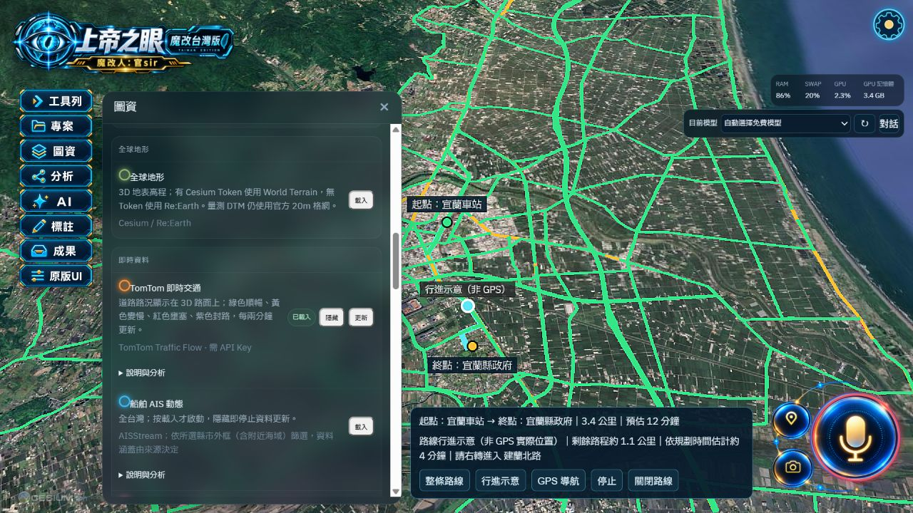
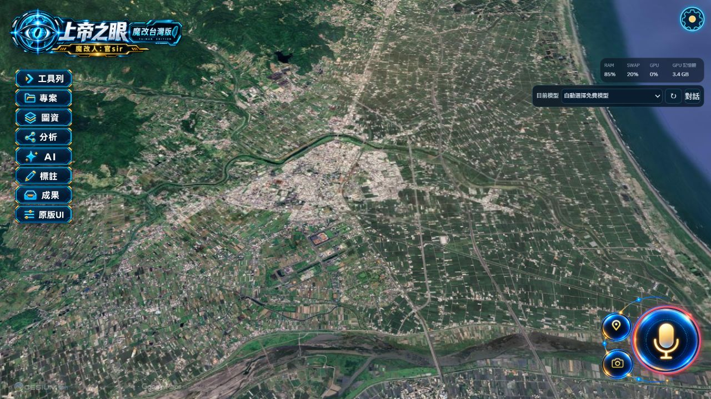
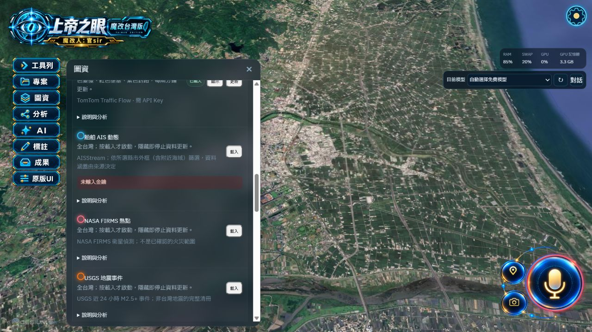

# 圖資提示、工具列、完整重設與 TomTom 路況修正

日期：2026-10-01。對象：目前本機瀏覽器版，服務 http://127.0.0.1:4175。

## 本次修改

- 需要服務金鑰的圖資在開始載入前檢查設定；缺少金鑰時在該項下立即顯示「未輸入金鑰」。設定讀取失敗與服務連線失敗另外說明，不混同缺少金鑰。
- 即時資料的「說明與分析」改為資料用途、是否開啟、筆數、最近取得時間及使用限制等白話段落，不直接顯示內部 JSON。船舶、熱點、地震、飛機與交通均適用。
- 工具列由 120 × 40 縮為 105 × 35 像素，向右移至距左緣 26 像素；維持同一組高解析度圖稿。其他介面文字使用正常字重。平衡模式的地圖解析度比例由 0.90 提升至 1.00；高資源壓力時仍保留自動保護。
- Ctrl＋S 在捕捉階段處理，兩種 UI 均適用：中止載入、停止即時更新、CCTV、語音、繪製與導航，關閉原版視覺功能，隱藏匯入圖層、關閉浮動面板並保留 Google 擬真 3D。專案與成果紀錄保留。Google 未連線或未設定金鑰時會直接提示原因。
- TomTom 改用真實向量路況，覆蓋地形與 3D Tiles，修正交通影像附著在被 Google 3D 遮住的地球表面而看不見的問題。按目前視野及所選範圍擷取，每兩分鐘更新；隱藏後停止刷新。金鑰由本機代理持有。
- 路況以綠／黃／紅／紫表示順暢／變慢／壅塞／封路。數量是道路線段，不是車輛數；同一幾何的多筆回報保留較壅塞者，不能據此認定所有方向都一樣。
- 導航增加起點、終點名稱、總距離、預估時間、剩餘路程與指引；路線加粗並置於高圖層順序。提供移動標記的 60 秒加速行進示意，明確標示「非 GPS 實際位置」；GPS 導航仍依瀏覽器定位授權及實際定位訊號運作。
- 延遲載入中的地形、交通及路線在重設後不得重新出現；Google 初始化失敗後可以重試載入。

## 驗收結果

1. `npm.cmd --prefix .work/upstream run build` 成功；最終前端檔案為 `assets/index-CkOIUrSe.js`。既有大檔及 Tauri 靜態／動態引用警告仍在，沒有編譯錯誤。
2. 9 個本次修改的來源與實際執行副本 SHA-256 完全相同。
3. 真實 TomTom 查詢「宜蘭車站 → 宜蘭縣政府」成功：3.4 公里，本次預估 12 分鐘。移動標記與剩餘距離會變化，並顯示指引。時間會隨路況更新。
4. 實際 Google 擬真 3D 上看見 TomTom 綠色及黃色路段；本次視野回傳 678 段道路。前幾次隔離瀏覽器連線曾失敗，最新正式版本重新載入後成功，未把先前失敗視為成功。
5. 開啟原版 UI 並啟動地震資料，於載入階段按 Ctrl＋S：資料開啟項目清空，導航摘要隱藏、路況消失、原版偵測／模型／範圍／銳化／光暈／繪製／天體關閉，畫面保留 Google 3D。
6. AIS 未設定金鑰：點擊載入後該項立即顯示「未輸入金鑰」，展開為可讀說明。
7. 瀏覽器 DOM 實測：8 個工具列按鈕均為 105 × 35，左座標 26；其他標題與說明的字重為 400。

## 驗收限制

- 未授予瀏覽器定位權限，尚未驗收真實 GPS 隨車導航。畫面的加速行進示意不能當成真實車輛位置。
- 即時交通是來源服務提供的道路速度資料，不是車流量或每一台車的定位；來源缺漏及連線失敗會顯示狀態。
- 本次未新增或執行自動測試套件，驗收為正式編譯及瀏覽器實際操作。

## 畫面紀錄

## 介接依據

- [TomTom Vector Flow Tiles 官方文件](https://docs.tomtom.com/traffic-api/documentation/tomtom-maps/v1/traffic-flow/vector-flow-tiles)：道路速度比例及封路標籤。
- [Cesium GroundPolylinePrimitive 官方文件](https://cesium.com/learn/ion-sdk/ref-doc/GroundPolylinePrimitive.html)：可將道路線分類至地形與 3D Tiles。
