<div align="center">

# 🌐 God's Eye View

[](https://github.com/bilawalsidhu/gods-eye-view/actions/workflows/ci.yml)

### A spy-satellite simulator in your browser — then you realize the sources are public and the data is real.

Photorealistic 3D globe. Live aircraft, ships, satellites, earthquakes, traffic, and public cameras. Hands-free voice control powered by a realtime AI agent.

_No place left behind._

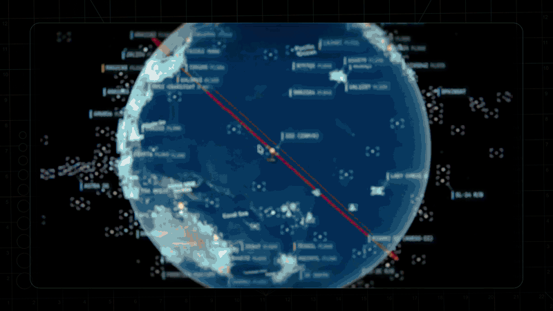

<a href="https://www.youtube.com/@bilawalsidhu">
  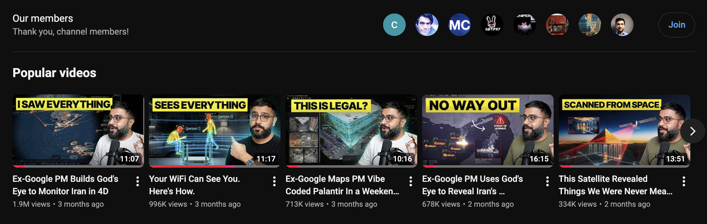
</a>

▶️ **From the project behind the viral God's Eye View series** _(formerly WorldView)_ — [5M+ on YouTube](https://youtube.com/playlist?list=PL6qSg2I-7_koPbDnSMo0QeeHX_RknA2uv&si=nBGYMoHWQw41v93Q) · [25M+ across socials](https://www.google.com/search?q=god%27s+eye+view)

[](https://x.com/bilawalsidhu/status/2093798887815348521)

🏆 **Reached #1 on GitHub Trending, daily and weekly · August 2026**

**[#8 Product of the Day](https://www.producthunt.com/products/god-s-eye-view?launch=god-s-eye-view)** · Hunted by Chris Messina, creator of the hashtag

_“pretty cool”_ — [Brendan Eich](https://x.com/BrendanEich/status/2094592096401490266), creator of JavaScript and co-founder of Mozilla and Brave · Featured on **[Pinokio](https://pinokio.co/posts/01m1m4p9xxm3qw7dnnpj2wr93g)**

⚡ **Start without API keys.** Install with [Pinokio](https://pinokio.co/apps/github-com-bilawalsidhu-gods-eye-view) or run locally from the terminal. Add optional keys inside the app. **[→ Quick Start](#-quick-start)**

</div>

---

<div align="center">

**[Quick Start](#-quick-start) · [First Five Minutes](#-the-first-five-minutes) · [Talk to It](#-talk-to-it) · [What's Live](#-whats-on-the-globe) · [Under the Hood](#-under-the-hood) · [Keys & Costs](#-api-keys)**

</div>

---

## 🌍 Why This Exists

God's Eye View brings public signals into one explorable globe. Track the world live. Talk to it. Break it. Extend it.

Flight transponders, ship beacons, orbital elements, seismographs, and public cameras already tell us a lot about the world. God's Eye View puts them in the same place, so you can move between a global picture and an individual aircraft, ship, or street. It runs locally in your browser, with source code you can inspect and extend.

> Half the magic is that it looks like a forbidden cockpit. The other half is that every line of code is inspectable.

Most feeds are live or regularly refreshed. Traffic is simulated along real
roads using aggregate location data. CCTV camera poses and rocket launch
trajectories are coarse estimates.

Start with the included data sources, then add your own. Each layer is a separate module.

---

## 🎛️ What This Thing Does

- **🛩️ Cockpit view:** Ride inside a tracked flight — the camera holds the terrain under you all the way down.
- **📡 Contacts:** A 250 km roster of everything near your target — step through live aircraft and drop into any cockpit.
- **🎯 Click-to-track anything:** Camera locks on, draws a fading trail, surfaces full metadata — and a tracked fire or vessel hands you off to the nearest live camera in one click.
- **🖊️ Voice whiteboard:** Speak annotations onto the world — real boundary polygons, marks, and routes.
- **🛫 3D hangar:** Real per-class aircraft models — 787, ATR-72, Citation, Bell 206, MQ-9 — and a tracked contact swaps from glyph to 3D model as you close in.
- **🎨 Reskin reality:** GLSL sensor looks over the normal globe — CRT, NVG, FLIR/thermal, Noir, Snow.
- **🟩 Detection overlay:** Screen-space bounding boxes and IDs on everything in view.
- **🎖️ Military HUD:** Tactical heads-up display with intelligence-style telemetry.
- **🌐 Global Context:** Stage the full situational picture with one switch — and get your exact view back when you leave.
- **🎥 Scene director:** Capture cinematic camera tours for clips and demos.
- **🔗 Share Links:** Camera, style, layers, and even one tracked target serialize into a URL — a live target is a handoff, not a bookmark.
- **🏠 Reset Globe:** One control — or one sentence — back to the full Earth.

---

<div align="center">

[](https://www.youtube.com/watch?v=GRJaKcXZS94)

▶️ **[The full walkthrough of everything below, on YouTube](https://www.youtube.com/watch?v=GRJaKcXZS94)**

</div>

## ⚡ Quick Start

**Start without an account or API keys.** Both paths open the same app with
Esri satellite imagery and keyless terrain. OSM is the fallback if Esri is
unreachable. Flights, military traffic, satellites, earthquakes, public
cameras, radio, and launches are available without keys.

For photorealistic 3D, add a **Cesium ion token** for eligible personal,
non-commercial use, or a **Google Maps key** for the direct, metered route and
in-app place search. Provider terms and quotas apply. Add keys through the
app's **POWER UP** panel; [Keys & Costs](#-api-keys) explains the options.

### Path 1 — One click, no terminal

1. Install or update [Pinokio](https://desktop.pinokio.co/) to **8.2 or later**.
2. Open [God's Eye View in Pinokio](https://pinokio.co/apps/github-com-bilawalsidhu-gods-eye-view).
3. Click **Install**, then **Start**.

Available on **Windows, macOS, and Linux**. The Pinokio maintainer reports
cross-platform testing of the fixed installer. The launcher installs the
locked dependencies, finds a free local port, and opens the app.

**Tried before and installation failed?** Update Pinokio and try again.
Version 8.2 fixes the launcher installation issue;
[details from the Pinokio maintainer](https://pinokio.co/posts/01m1m4p9xxm3qw7dnnpj2wr93g).

### Path 2 — Terminal / coding agent

Use **Node.js 24.x (24.14.0 or later) or 26.x**. The setup doctor warns about
Node 25, which is end-of-life.

```bash
git clone https://github.com/bilawalsidhu/gods-eye-view.git
cd gods-eye-view
npm ci
npm run doctor
npm run dev
```

Open **`http://localhost:4173`**. Choose **Live Contacts**, **Space Missions**,
**Environmental**, or **Explore Manually** from the first-run panel.

<details>
<summary>Startup performance</summary>

A point-in-time M5/Chrome capture measured a median 1.86-second cold start.
This is a comparison baseline, not a guarantee for your machine or connection.
See [docs/PERFORMANCE.md](docs/PERFORMANCE.md).

</details>

**macOS shortcut:** `./scripts/dev-fresh.sh` clears the Vite cache and pulls any
configured keys straight from the Keychain. It starts keyless too.

### Then power it up — in the app, not in a file

Keys are upgrades, not prerequisites. When you want one, click the **POWER UP**
chip in the bottom-right corner: Provider Settings lists every supported key,
what it switches on, and where to get it. Paste, hit **SAVE KEYS**, and the app
restarts itself with the new capability on. Once everything is configured the
chip reads **POWERED UP** — and if a compact layout hides it, `?setup=1`
reopens the same panel.

- **Where keys land:** Pinokio → the app's ignored `pinokio/ENVIRONMENT`; a
  terminal clone → the repo-root `.env`. Either file is made owner-only
  _before_ a secret is written into it. These are local plaintext files,
  excluded from Git; the app uses your keys to contact the providers.
- **Keys you already have stay yours:** values from your shell or the macOS
  Keychain show as _configured externally_ and are read-only to the panel.
- **What to get first:** the free [Cesium ion](https://cesium.com/ion) token
  (eligible personal, non-commercial use; current terms and quotas apply) for
  photorealistic 3D and world terrain; a Google Maps key only for the
  billing-enabled, metered route + place search; OpenAI when you want to talk
  to the world. Full map, costs included, in [Keys & Costs](#-api-keys).

<details>
<summary>Older Pinokio versions and credential storage</summary>

Do not enter credentials in Pinokio 8.0.40's native **Configure** panel: that
release does not save this nested app file correctly, and it logs submitted
values. Use **POWER UP → Provider Settings** inside GEV instead. The Pinokio
8.2 announcement fixes installation; it does not establish that this separate
Configure issue is resolved. On macOS, the Keychain via
`./scripts/dev-fresh.sh` remains the stronger storage option.

</details>

The server binds to **localhost** on both paths, and Provider Settings answers
requests only from your machine. Browser-side keys (Google Maps, Cesium ion)
must be restricted at their providers — [SECURITY.md](SECURITY.md) shows how,
and it carries the LAN-sharing rules alongside [Keys & Costs](#-api-keys).

---

## 🕐 The First Five Minutes

Choose a first-run mission, or try these in order. The GIFs show Google Photorealistic 3D; your starting basemap depends on the keys you've added.

1. **Light up the sky.** Take the **Live Contacts** mission (or turn on **Flights** yourself) — thousands of live aircraft, gliding on real telemetry, detection mesh already reading the scene. Click one: the camera locks on, a trail draws behind it, and its live telemetry card comes up.
2. **Take the controls.** Hit **COCKPIT** on your tracked plane and ride it down, switching sensors mid-flight: NVG into Ironbow FLIR.

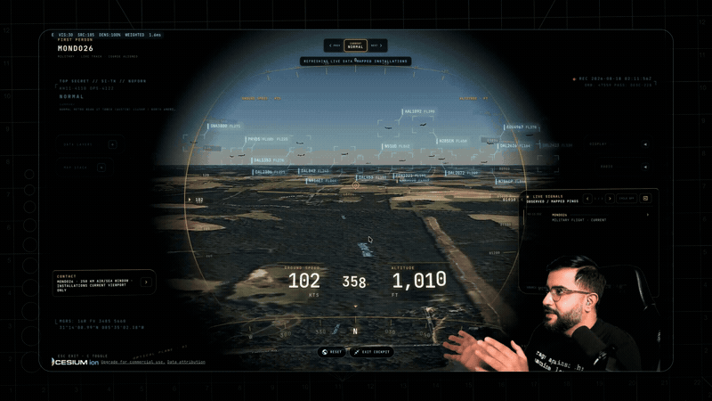

3. **Drop into a busy airport.** Search one and descend to the taxiways with **3D** aircraft on — grounded contacts, taxi trails, the whole apron working in real time.

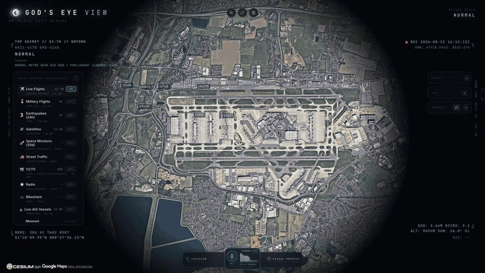

4. **Look through a public camera.** Turn on **CCTV** over Austin, London, California, or Finland. The feeds aren't webcam embeds — they project _into_ the 3D city. Cycle coverage to **VIEWSHED** and every camera draws its estimated coverage volume — where it reaches, and where it goes blind.

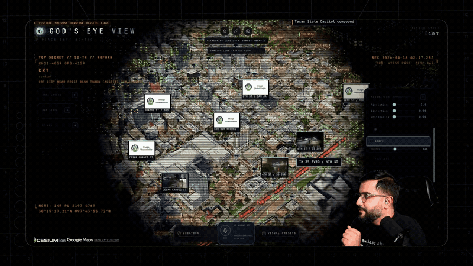

5. **Track something in orbit.** Turn on **Satellites** and click the ISS — you ride along at orbital distance, orbit ring and all.

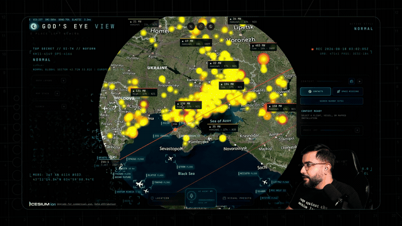

6. **Switch the optics.** Tap `1`–`7` — CRT, NVG, FLIR — and the whole live planet re-renders through a different sensor.

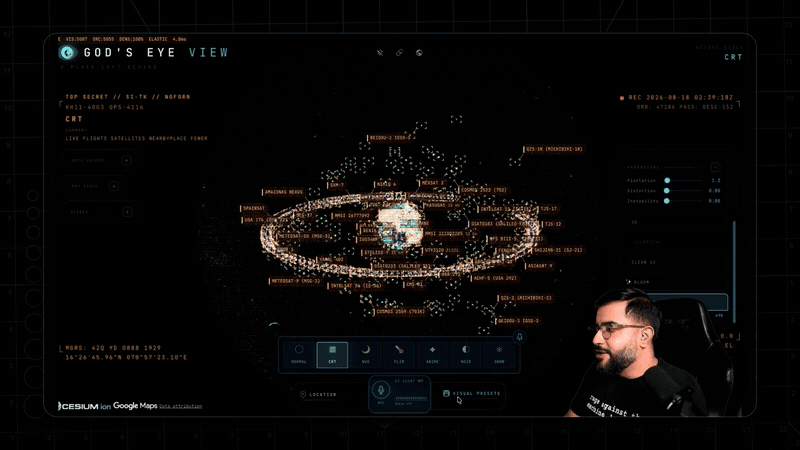

7. **Talk to it** _(needs an OpenAI key)_: _"Take me to LAX and select the nearest airborne aircraft."_
8. **Come home.** Hit **Reset Globe** — or just say _"zoom out to a globe view."_

**Keyboard:** `1`–`7` visual styles · `H` HUD · `D` detection · `C` cockpit · `Esc` out.

---

## 🛩️ The Cockpit

> Every plane should let you do this.

Real-time cockpit mode, built from live flight data: the camera rides your contact with real terrain holding underneath, all the way down — sensor styles come along for the ride, and **Contacts** keeps the 250 km roster one click away: jump plane to plane and fall straight into the next cockpit.

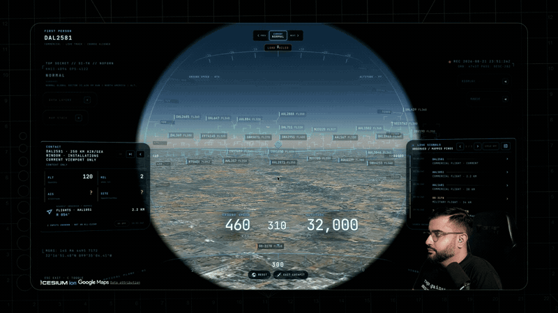

The cockpit even carries its own briefing strip: nearby live signals, regional headlines, and real local weather — with an opt-in **WX** mode that renders volumetric clouds from actual observations around your aircraft.

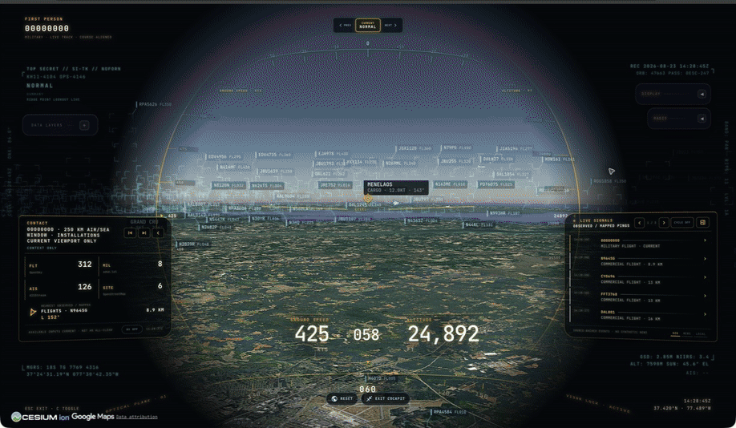

_Why cockpit mode exists: you're riding a real aircraft over real terrain — and you get to pick which sensor you see the world through._

---

## 🎙️ Talk to It

> Voice needs an **OpenAI key**. Without one the entire app still runs — the mic button just reports voice is unavailable. The same key drives the **AI HUD summary**: a terse, five-word intelligence-style readout of the current view that regenerates as you move.

Click **GEV MIC**, grant the microphone, and just talk. This is more than a voice-controlled remote:

- **🧠 It knows what it's looking at.** The agent pulls live scene context before answering — including coordinates, street names, active layers, and view scale. Ask _"what city is this?"_ mid-flight and it knows.
- **🎯 Entity Q&A.** Click any plane, ship, or datacenter and ask _"what's this?"_ It answers using the object's live telemetry.
- **👁️ Visual grounding.** At street level, it reads a viewport screenshot to identify legible signage and building names, and is instructed never to hallucinate labels.
- **🎬 Cinematic framing.** _"Show me the planes overhead"_ pulls the camera back, angles it, and frames the live traffic like a director.
- **🔒 Honest and secure.** The agent only confirms actions that succeeded. Your `OPENAI_API_KEY` never touches the browser; the client only gets a short-lived session token.

Twenty-eight tools, four jobs — the commands below come straight from the product's voice test suite and tool playbook:

**🎥 Direct it** — drone-operator camera verbs:

> 🗣️ _"Take me to Tokyo."_ · _"Orbit around this area slowly."_ · _"Draw the walking route from the Capitol to Zilker Park."_ → _"Fly the route we just drew."_ · _"Zoom out to a globe view."_

**🖊️ Annotate it** — a whiteboard over the real world:

> 🗣️ _"Outline the state of Texas."_ · _"Annotate the Texas State Capitol and its grounds"_ — it draws the **actual enclosing boundary**, not a circle. · _"How far is the Eiffel Tower from the Louvre?"_ — a connector arrow appears and it speaks the distance. Everything persists until you say _"clear the map."_

**✍️ Or draw it yourself** — DISPLAY ▸ **Draw**: pick Area, Line or Pin, click the vertices on the real world, double-click to finish, label it. Same whiteboard, same persistence, no microphone needed.

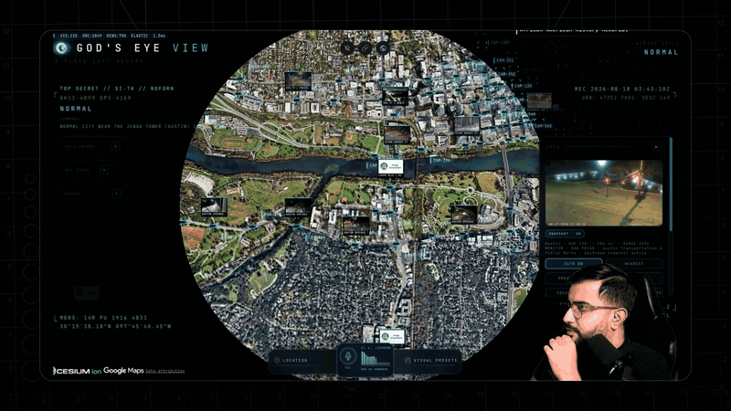

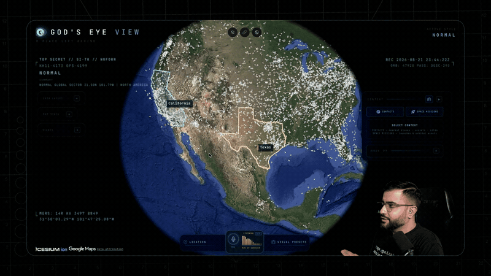

**🔎 Interrogate it** — analyst queries against the live layers:

> 🗣️ _"How many flights are over Texas right now?"_ · _"Which ships are headed to Oakland?"_ · _"What is the biggest fire near Los Angeles?"_ · _"Is anything flying above forty thousand feet?"_ · _"When does the ISS pass over next?"_

**🎛️ Operate it** — the whole console, hands-free:

> 🗣️ _"Switch to night vision and turn on the flights layer."_ · _"Turn on the camera viewsheds."_ · _"Play a news radio station near Austin."_ · _"Track that plane."_ → _"Enter Cockpit."_

**And the rapid-fire tier** — one sentence each:

> 🗣️ _"Show me global infrastructure."_ (stages the layers and pulls back to the globe) · _"Play Orbital Watch."_ (a full cinematic scene) · _"Set detection density to fifty percent."_ · _"Next contact — helicopters only."_ (mid-cockpit) · _"Show me space missions."_ · _"Switch to OSM."_ · _"Sharpen the image a touch."_ · _"Switch to the tactical layout."_ · _"What's turned on right now?"_

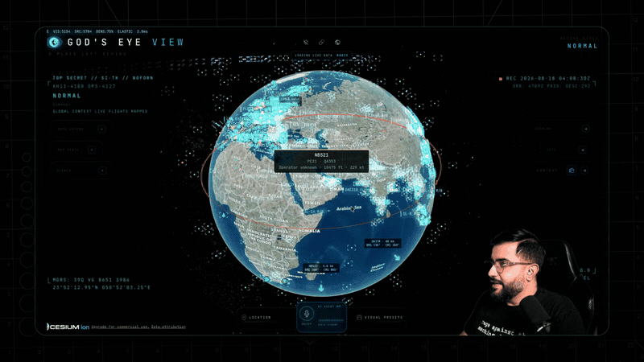

_Ask for radio near anywhere and the globe starts broadcasting — every station is a real place you can fly to._

---

## 🛰️ What's on the Globe

Fifteen layers and map sources. **Thirteen have a keyless path.** Some offer additional capabilities with a provider key. (🟢 no key · 🟡 free key · 🔴 metered.)

| Layer                       | What you get                                                                                                                                                                                                                                                                                                                                                                        | Source                                  | Auth                                                                                                |
| --------------------------- | ----------------------------------------------------------------------------------------------------------------------------------------------------------------------------------------------------------------------------------------------------------------------------------------------------------------------------------------------------------------------------------- | --------------------------------------- | --------------------------------------------------------------------------------------------------- |
| 🗺️ **Map Stack**            | Esri satellite imagery, Google Photorealistic 3D, OSM, plus additional ion-hosted stacks                                                                                                                                                                                                                                                                                            | Esri / Google / Ion / OSM               | 🟢 Esri satellite + OSM · 🟡 ion-hosted Google 3D + world terrain · 🔴 direct Google + place search |
| ✈️ **Live Flights**         | 11,000+ live aircraft + route history                                                                                                                                                                                                                                                                                                                                               | OpenSky + adsb.lol                      | 🟢 (🟡 optional for more polling credits)                                                           |
| 🎖️ **Military Flights**     | ADS-B military traffic in amber                                                                                                                                                                                                                                                                                                                                                     | adsb.lol                                | 🟢                                                                                                  |
| 🚢 **Live Vessels**         | Thousands of ships worldwide                                                                                                                                                                                                                                                                                                                                                        | AISStream                               | 🟡                                                                                                  |
| 🛰️ **Satellites**           | 838-object catalog, color-coded by class with a live legend — the **DENSE** chip drops in the whole Starlink shell                                                                                                                                                                                                                                                                  | CelesTrak                               | 🟢                                                                                                  |
| 🌍 **Earthquakes**          | Global seismic activity, last 24h                                                                                                                                                                                                                                                                                                                                                   | USGS                                    | 🟢                                                                                                  |
| 🚗 **Traffic**              | Simulated vehicles on OSM roads. With TomTom, live flow speeds drive the simulation and congestion colors below ~8 km; individual vehicle positions are not live observations                                                                                                                                                                                                       | TomTom + OSM                            | 🟢 simulation · 🟡 live flow speeds                                                                 |
| 📹 **CCTV Mesh**            | ~3,600 public cameras projected _into_ the 3D space — Austin · Texas (TxDOT) · California (Caltrans) · London (TfL) · Ontario (511) · Finland (Fintraffic) · British Columbia (DriveBC) · Estonia (Tallinn, Tarktee) · New South Wales (Live Traffic NSW) · Calgary. Positions are published; poses are estimated priors **you calibrate by dragging a gizmo on the camera itself** | City APIs                               | 🟢                                                                                                  |
| 📻 **Radio**                | Geolocated world radio with an **analog tuner** — drag the needle across up to 750 stations and the globe flies to each broadcaster                                                                                                                                                                                                                                                 | Radio Browser / broadcasters            | 🟢                                                                                                  |
| 🚌 **Transit**              | Live buses, trams, metros, trains and ferries with delayed playback between reports, selected-vehicle trails, and mode-coloured DETECT labels — Boston, Austin, Minneapolis, Helsinki, the Netherlands, Norway, South East Queensland                                                                                                                                               | Operator GTFS-Realtime feeds            | 🟢                                                                                                  |
| 🚲 **Bikeshare**            | Live station availability                                                                                                                                                                                                                                                                                                                                                           | GBFS                                    | 🟢                                                                                                  |
| 🧭 **Directions**           | Click A and B on the globe for a street-following drive, walk or cycle route draped on the terrain with turn-by-turn steps — then FLY the camera along it. No key, no geocoder, no mic                                                                                                                                                                                              | OSRM on FOSSGIS servers (OpenStreetMap) | 🟢                                                                                                  |
| 🔥 **Active Fires**         | Live NASA FIRMS detections, trailing 24h                                                                                                                                                                                                                                                                                                                                            | NASA FIRMS                              | 🟡                                                                                                  |
| 🚀 **Space Missions**       | Rolling 30-day launches with payload, stage, and recovery detail                                                                                                                                                                                                                                                                                                                    | Launch Library 2                        | 🟢 (🟡 optional token raises the allowance)                                                         |
| 🎖️ **Mapped Installations** | Viewport-bounded military-site context from community mapping — incomplete by nature, and labeled that way                                                                                                                                                                                                                                                                          | OpenStreetMap                           | 🟢                                                                                                  |

**The basemap ladder — what each tier buys you:**

| You have                   | The globe you get                                                                                                                                                            |
| -------------------------- | ---------------------------------------------------------------------------------------------------------------------------------------------------------------------------- |
| 🟢 Nothing                 | Esri World Imagery satellite basemap + keyless terrain, in 2D. OSM takes over automatically if Esri is unreachable; if terrain is unavailable the globe continues without it |
| 🟡 A free Cesium ion token | **Google Photorealistic 3D cities** and world terrain — eligible personal, non-commercial use; current ion terms and quotas apply                                            |
| 🔴 A Google Maps key       | The same 3D direct from Google, plus in-app place search — the billing-enabled, metered route                                                                                |

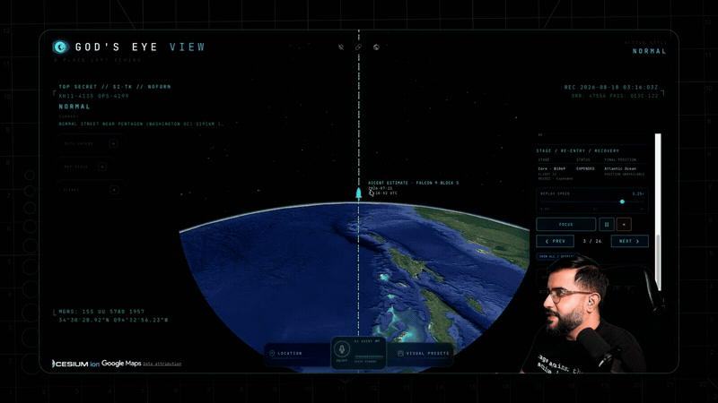

_The Space Missions layer replaying a Falcon 9 ascent — labeled `RECONSTRUCTED ESTIMATE`, scrubbable 0.25×–4×._

**Also on the globe:** neighborhood overlays · an optional cockpit WX cloud effect. **Bundled static infrastructure:** Datacenters (4,351), Dams (704), and Submarine Cables (712).

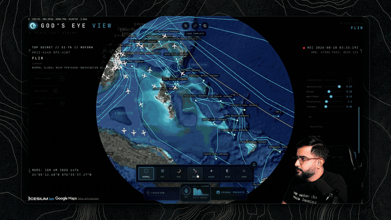

**Missing a layer you want?** Open an issue — or add it and send the PR.

---

## 🎖️ Field Missions

Once the basics click, run these:

| Mission                             | How                                                                                                                                                                                                       |
| ----------------------------------- | --------------------------------------------------------------------------------------------------------------------------------------------------------------------------------------------------------- |
| **🚁 Ask the planet**               | _"Why are all these military helicopters flying in circles?"_ Select a military track — it silently backfills ~24 h of real trace history — and see what it's been doing, resolved as stacked 3D loops.   |
| **✈️ Final approach**               | Click-track an airliner lining up for a runway, hop into the **cockpit**, and ride it down.                                                                                                               |
| **🌃 Night watch**                  | Fly to your own city, switch to **NVG**, and let the detection mesh and HUD read the scene.                                                                                                               |
| **🚢 Port call**                    | Vessels on over the Port of Long Beach. Click a tanker for its tactical card and wake trail — then hit **NEAREST** in the CCTV panel and look at the same water through a public camera.                  |
| **📻 Tokyo FM**                     | Orbit Shibuya with the **Radio** layer on — then drag the analog tuner needle: every position snaps to a real station and the globe flies to whoever's broadcasting.                                      |
| **🔥 Fire line**                    | FIRMS over California. Click a detection — the camera dives to it — read the intensity, then hit **NEAREST** in the CCTV panel for a ground view.                                                         |
| **🚶 Ask for a walking route** _🎙️_ | Tell the world where you want to go and watch a real street-following route trace itself through the 3D city — then _"fly it"_: banked turns, eased ends, a camera that leads the path like a drone shot. |
| **📏 Measure LAX to DFW** _🎙️_      | _"How far is LAX from DFW?"_ — an arrow spans the country, the distance lands in the caption, and the endpoints stay pinned to the real world as you orbit.                                               |
| **🚀 Launch replay**                | Open **Space Missions**, pick a launch from the last 30 days, and ride the T-minus countdown through ascent to orbit — scrub it at 0.25×–4×. Labeled `RECONSTRUCTED ESTIMATE`, because it is one.         |
| **🪦 Walk the boneyard**            | Fly from regional context down into dense, fully resolved rows of retired aircraft.                                                                                                                       |
| **🏗️ Orbit Three Gorges**           | Sweep the dam and its terrain at a glance — then flip on the **Dams** layer and find 703 more.                                                                                                            |

_🎙️ = voice missions — they need an OpenAI key._

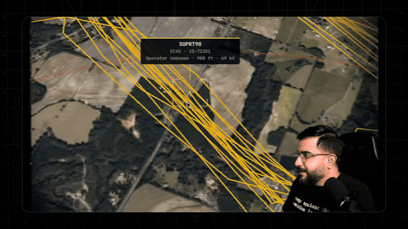

_Ask the planet: a military contact's last ~24 hours of real trace history, resolved as stacked 3D loops._

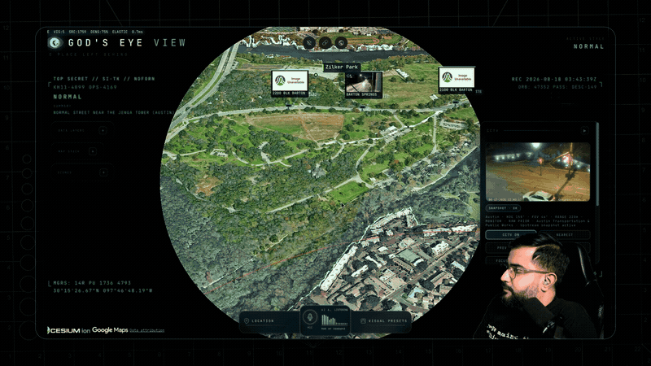

_"Draw the walking route… now fly it" — banked turns, eased ends, the camera leading the path like a drone shot._

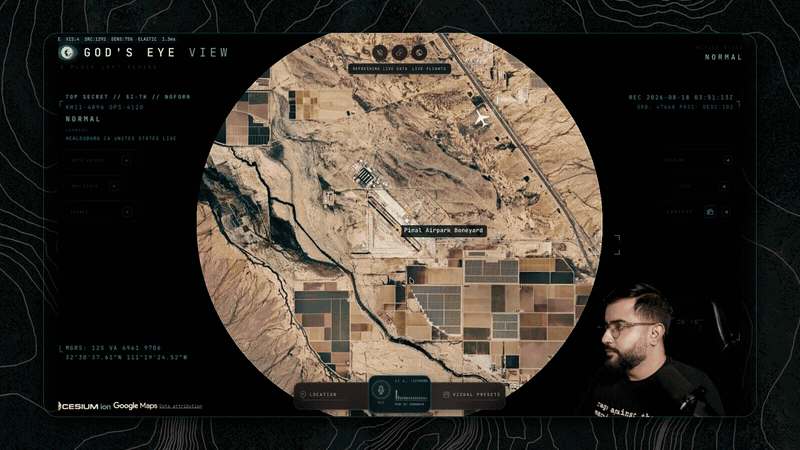

_Walk the boneyard: rows of retired airframes, fully resolved in 3D._

---

## 🔧 Under the Hood

How the globe handles live data:

- **World-stable icons.** Aircraft and ships point along their _true real-world heading_ at every camera angle — tracked or not, looking straight down or across the horizon — via per-frame screen-space course projection. No spinning, no viewport-locking.
- **Smooth motion from choppy data.** Live feeds arrive every 15–30s; the globe renders one interval behind real time and interpolates between known fixes. Dead reckoning fills the gaps.
- **Honest satellites.** SGP4 propagation with orbit rings that stay locked to their satellites via GMST realignment — no drift, no per-second flicker.
- **Sits on the real ground.** Entity heights are aligned to work with Google 3D tiles, so aircraft park on aprons and cameras stand on street corners instead of floating.
- **Caching and request budgets.** An OpenSky credit governor, a TomTom daily tile budget, and disk-cached TLEs reduce repeated requests. These controls do not replace provider quotas or billing controls.
- **Server-side credentials.** Every API that touches a private key (OpenAI, AISStream, OpenSky OAuth, camera frames) is brokered through a hardened server-side proxy with SSRF protection, response caps, and sanitized errors. The only keys the browser sees are Google Maps and Cesium ion (restrict both at the provider).
- **No framework.** Vanilla JavaScript, **CesiumJS**, and **Vite** — plus **Google Photorealistic 3D Tiles** for the planet and the **OpenAI Realtime API** for voice. Fast to read, fast to hack on.

```
src/
├── main.js                 # Bootstrap: Google 3D tiles, layer registration
├── ui.js                   # Runtime UI — panels, HUD, styles, control facade
├── hud.js                  # Intelligence HUD + AI scene summary
├── keySetup.js             # POWER UP panel — in-app provider keys (dev server only)
├── mapStackController.js   # Basemap switching — Google 3D / Esri / OSM / ion stacks
├── voice/                  # OpenAI Realtime session + 28 voice tools
├── data/                   # One module per layer + orchestration + context store
│   ├── iconOrientation.js  # Screen-projected headings + horizon cull
│   └── local_data/         # Bundled datasets (per-folder provenance)
└── scenes/                 # Cinematic scene director
```

See [`docs/CURRENT-STATE.md`](docs/CURRENT-STATE.md) for the authoritative runtime reference.

---

## 🔑 API Keys

🟢 **No key** · 🟡 **Free key** · 🔴 **Metered**

Use **POWER UP → Provider Settings** to add keys. The tables below explain what
each provider enables; none is required to start. See the
[setup instructions](#then-power-it-up--in-the-app-not-in-a-file) for storage
and configuration details.

### Choose the capabilities you want

Six keys. Four have a free tier, and the two 🔴 ones are metered:

|     | Key             | Why                                                                                                                                                                                  | Get it                                                                                                                                                               |
| --- | --------------- | ------------------------------------------------------------------------------------------------------------------------------------------------------------------------------------ | -------------------------------------------------------------------------------------------------------------------------------------------------------------------- |
| 🟡  | **Cesium ion**  | 🗺️ Google Photorealistic 3D, world terrain, and additional ion-hosted imagery stacks. The free Community plan is for eligible individual, personal/non-commercial use and has quotas | [cesium.com/ion](https://cesium.com/ion) — use a public `assets:read` token and check current [pricing/eligibility](https://cesium.com/platform/cesium-ion/pricing/) |
| 🔴  | **Google Maps** | Direct Google Photorealistic 3D + Google place search ([Map Tiles API](https://developers.google.com/maps/documentation/tile))                                                       | [Google Cloud Console](https://console.cloud.google.com/) — URL-restrict it                                                                                          |
| 🔴  | **OpenAI**      | 🎙️ The voice experience + AI HUD summary. The mini model works; the standard model is noticeably smarter. Want Gemini or another provider behind the mic? PRs welcome                | [platform.openai.com](https://platform.openai.com) — metered, see costs below                                                                                        |
| 🟡  | **AISStream**   | 🚢 Live global ships                                                                                                                                                                 | [aisstream.io](https://aisstream.io) — free signup                                                                                                                   |
| 🟡  | **NASA FIRMS**  | 🔥 Live active fires                                                                                                                                                                 | [firms.modaps.eosdis.nasa.gov](https://firms.modaps.eosdis.nasa.gov/api/map_key/) — free                                                                             |
| 🟡  | **TomTom**      | 🚦 Live flow speeds and congestion colors for the simulated traffic layer                                                                                                            | [developer.tomtom.com](https://developer.tomtom.com) — free tier available                                                                                           |

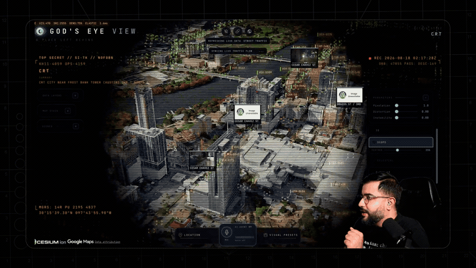

_What the TomTom key buys you: rush-hour density painted on the city — then dive from the jam straight into the camera watching it._

### Cherry on top

|     | Key                  | Why                                                           | Get it                                             |
| --- | -------------------- | ------------------------------------------------------------- | -------------------------------------------------- |
| 🟡  | **OpenSky**          | ✈️ More flight-polling credits (🟢 anonymous works without)   | [opensky-network.org](https://opensky-network.org) |
| 🟡  | **Launch Library 2** | 🚀 Higher space-missions request allowance (🟢 works without) | [thespacedevs.com](https://thespacedevs.com)       |

Add these if you need higher polling allowances.

`npm run doctor` reports Node/npm readiness, the primary provider routes, and
where each configured provider was found without printing credential values.
On macOS its Keychain-aware result previews `./scripts/dev-fresh.sh`; plain
`npm run dev` reads only explicit environment and Vite dotenv values. The
OpenSky summary reports only OAuth client-pair presence, not the resolved
runtime mode or credential validity; Basic and credentials-file modes remain
advanced `dev-fresh.sh` configuration.

<details>
<summary>Advanced setup: environment variables and macOS Keychain</summary>

For headless machines, coding agents, or scripted setups:

```bash
# Put keys in .env (see .env.example), or pass them as env vars:
OPENAI_API_KEY="…" AISSTREAM_API_KEY="…" npm run dev -- --host localhost --port 4173

# On macOS, store any of them in the Keychain and dev-fresh.sh pulls them in:
security add-generic-password -U -s "google-maps-api" -a "api-key" -w
security add-generic-password -U -s "openai-api"      -a "api-key" -w
security add-generic-password -U -s "aisstream-api"   -a "api-key" -w
security add-generic-password -U -s "firms-map"       -a "map-key" -w
security add-generic-password -U -s "cesium-ion"      -a "token"   -w
```

OpenSky can run fully anonymous (`OPENSKY_AUTH_MODE=anon`), or import OAuth credentials with `./scripts/opensky-import-client.sh /path/to/credentials.json`.

</details>

### 💸 What it actually costs

Honest numbers, roughly, as of mid-2026 — always check the provider pricing pages:

|                          | Cost reality                                                                                                                                                                                                                                                                                                                                                                |
| ------------------------ | --------------------------------------------------------------------------------------------------------------------------------------------------------------------------------------------------------------------------------------------------------------------------------------------------------------------------------------------------------------------------- |
| **🟢 Most layers**       | **$0, no signup.** OpenSky anon, USGS, CelesTrak, adsb.lol, city CCTV, Radio Browser, GBFS, Launch Library 2, bundled datasets.                                                                                                                                                                                                                                             |
| **🟡 The free-key tier** | **$0 with a signup.** AISStream, FIRMS, TomTom, OpenSky, plus Cesium ion for eligible personal/non-commercial use. Provider quotas and eligibility still apply.                                                                                                                                                                                                             |
| **🗺️ Google 3D tiles**   | **Free through an eligible Cesium ion Community account within its quota; metered through a direct Google key.** Use the direct route for GEV place search or commercial deployment, verify current provider terms, and set budget alerts where billing is enabled.                                                                                                         |
| **🔴 OpenAI voice**      | **The one that costs real money — so the app meters it for you.** Realtime audio runs a few cents per active minute; an evening of heavy use is single-digit dollars. A live session-spend readout sits next to the mic, with an STD/MINI model toggle, a $2 warning, and a **$5 hard cap that ends the session**. The voice context window is kept deliberately short too. |

Google's direct 3D route is surprisingly generous: the first 1,000 Photorealistic
3D Tiles sessions each month are currently free, and one root request supports
roughly three hours of rendering. A solo user exploring sparingly can
realistically stay inside the free usage cap. Billing must still be enabled, so
restrict the key and set a quota or budget alert. Check Google's
[current pricing](https://developers.google.com/maps/billing-and-pricing/pricing)
before relying on these figures.

### 🧗 The floor is low on purpose

Everything above is the deliberately cheap baseline — enough to get a real taste of geospatial intelligence, GEOINT, and OSINT without ever talking to a sales team. You'll also notice the ceiling: terrestrial AIS goes quiet mid-ocean and satellite AIS costs real money; premium imagery, SAR, and the deeper commercial feeds live behind enterprise contracts. That's not a limit of the architecture — every layer here is a pattern you can point at your own data sources. This repo hands you the foundation; what you fuse into it is up to you.

### 🔒 Sharing an instance

By default nobody else can reach your server — it binds to localhost. To share on your LAN, opt in explicitly (`npm run dev -- --host 0.0.0.0 --port 4173`, or `HOST=0.0.0.0 ./scripts/dev-fresh.sh` on macOS/Linux) — but know that ⚠️ **a LAN-visible server brokers your configured API keys to anyone who can reach it.** Set the per-IP throttles (`GEV_RATELIMIT_OPENAI_PER_MIN`, `GEV_RATELIMIT_GOOGLE_PER_MIN` — see `.env.example`) and, before anything else, **configure provider quotas, usage limits, and billing alerts**: app-level throttles are not billing caps, and a budget alert alone does not stop spending. Full threat model in [SECURITY.md](SECURITY.md).

Provider Settings is disabled when the server is shared, so remote users cannot
access the key-entry panel.

**Pinokio LAN and Cloudflare sharing remain disabled for this launcher.** Use
a separately reviewed authentication proxy if remote access is required.
[SECURITY.md](SECURITY.md) explains the restrictions and threat model.

---

## 📋 Responsible & Open

God's Eye View runs on **public data, clear sources, and local-first execution.** No secrets, no private datasets, no mystery scraping — anything involving a private key is brokered server-side. It has the visual grammar of a classified ops room, built entirely from open signals and inspectable code.

**The line.** This project models **events, assets, infrastructure, and systems** — aircraft, vessels, satellites, fires, cameras, cities. It does not build features for named-person search, face recognition, or tracking individuals, and pull requests that cross that line won't be merged. People are not a query type here.

**Come build it.** This is the canonical live 3D client from the project that kicked off the recent wave of spatial-intelligence tools — and it's a canvas: the layers here are the signals one person could find and fuse. Add a city pack, a data source, a style, a voice tool. It's the window through which you see the world; bring that window to others.

**Status:** An evolving open-source client for exploration and learning — a fast, hackable foundation, not a hardened production service. Released under the **[MIT License](LICENSE)**. Bundled and live datasets carry their own terms — see **[DATA_SOURCES.md](DATA_SOURCES.md)**. Security model: **[SECURITY.md](SECURITY.md)**. Want to contribute? **[CONTRIBUTING.md](CONTRIBUTING.md)**.

**Maintainers:** [Bilawal Sidhu](https://github.com/bilawalsidhu) and [Sameh Khamis](https://github.com/samehkhamis) at [Halfpixel](https://halfpixel.ai).

<sub>Media note: the capture GIFs on this page show Google Photorealistic 3D Tiles and live data layers, used promotionally with in-frame attribution; they aren't licensed for standalone reuse. See [media provenance and permissions](docs/media/README.md); full source terms in [DATA_SOURCES.md](DATA_SOURCES.md).</sub>

> [!IMPORTANT]
> God's Eye View is an exploratory visualization of public and third-party data.
> Data may be delayed, incomplete, modeled, inferred, or wrong. Do not use it
> for flight or maritime navigation, emergency response, medical or health
> decisions, investment decisions, or other safety-critical or operational
> purposes. Verify important information with authoritative sources.

---

## 🧭 What's Next

First — thank you. To everyone who watched the God-view demos and went off to build their own, and to everyone who kept asking for the code: I'm grateful. And when I polled whether this should go open source, you weren't subtle about it:

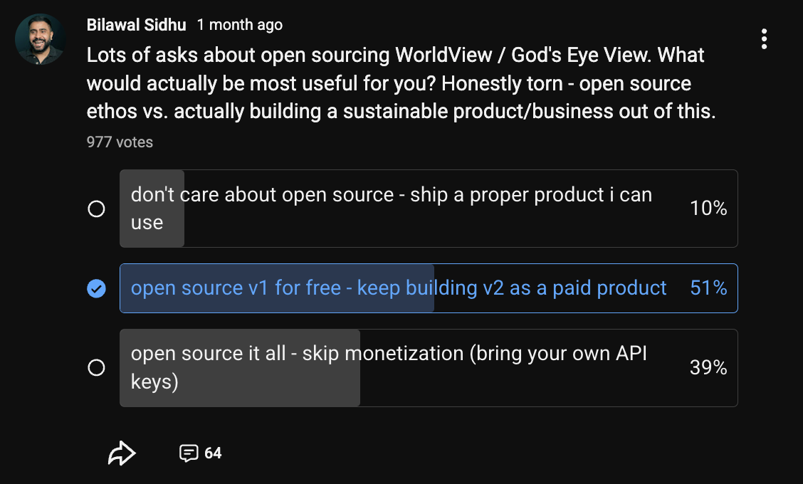

So here it is. Step inside the spy-thriller cockpit — except the data is real — and let's turn this into our shared sandbox for making sense of the world, and have fun doing it. This repo is the baseline, it stays open, and the whole point is for you to break things and bolt on layers we haven't thought of yet.

One heads-up from the inside: build in this space for a week and you learn that **the present is the cheap part**. The moment you try to go back in time — tiling, serving, and scrubbing _what happened_ and _what changed_ at any real resolution — the data gets expensive and the compute gets brutal. That's the long game.

**Update — a hosted version is coming.** We originally planned to keep this repository as the open-source client and build a separate professional product. Then the launch happened, and the loudest request wasn't another feature — it was _"just give me a link."_ So we're building an official hosted God's Eye View at [Halfpixel](https://halfpixel.ai): no installation, just open it in your browser. The hosted version is the easiest way into this open-source project. More soon.

---

<div align="center">

▶️ [Watch the God's Eye View series](https://youtube.com/playlist?list=PL6qSg2I-7_koPbDnSMo0QeeHX_RknA2uv&si=nBGYMoHWQw41v93Q) · 📬 [Map the World](https://maptheworld.ai/) — the newsletter behind the project

**🌐 God's Eye View. No place left behind.**

</div>
